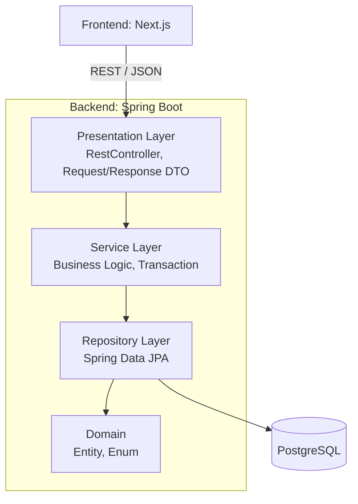
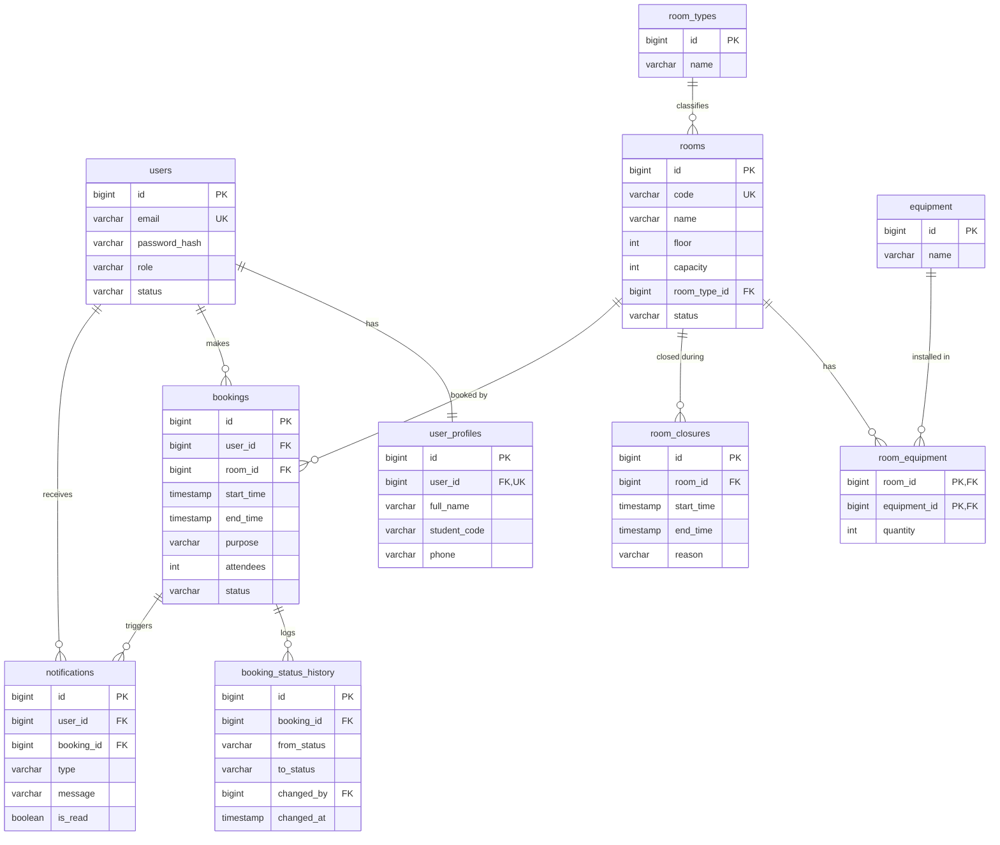

# SC09 Room Booking

ระบบจองห้องของวิทยาลัยการคอมพิวเตอร์ มหาวิทยาลัยขอนแก่น ครอบคลุมเฉพาะห้องในอาคารวิทยวิภาส (SC09)
นักศึกษาและอาจารย์ค้นหาห้องว่างตามวัน เวลา ความจุ และอุปกรณ์ แล้วส่งคำขอจองได้
ระบบตรวจกฎการจองตามบทบาทผู้ใช้และป้องกันการจองเวลาชนกัน
เจ้าหน้าที่อนุมัติหรือปฏิเสธคำขอ จัดการห้องและอุปกรณ์ และดูสถิติการใช้ห้อง
ผู้ใช้ได้รับแจ้งเตือนในระบบทุกครั้งที่สถานะการจองเปลี่ยน

โปรเจกต์รายวิชา CP353002 Principles of Software Design and Development

## สมาชิกกลุ่ม

| ลำดับ | ชื่อ-นามสกุล | รหัสนักศึกษา | Section | Branch | หน้าที่รับผิดชอบ |
| --- | --- | --- | --- | --- | --- |
| 1 | ดรัณภพ สุริเตอร์ | 6733804024 | 03 | `darunphop_6733804024_03` | โมดูลผู้ใช้และการยืนยันตัวตน (User, UserProfile, JWT), ฐานราก backend (Global Exception Handler, Security, Swagger), Strategy Pattern สำหรับกฎการจองตาม role, หน้า login, register, profile, จัดการผู้ใช้ |
| 2 | กฤษฎา นามมนต์เทียน | 6733803882 | 03 | `kritsada_6733803882_03` | โมดูลห้องและอุปกรณ์ (CRUD Resource ที่ 1), Pagination, Sorting และตัวกรอง, ความสัมพันธ์ Many-to-Many ห้องกับอุปกรณ์, ค้นหาห้องว่าง, ช่วงปิดห้อง, หน้ารายการห้องและจัดการห้อง |
| 3 | อนัตตา โยคาพจร | 6733804294 | 03 | `anatta_6733804294_03` | โมดูลการจอง (CRUD Resource ที่ 2), Chain of Responsibility สำหรับตรวจกฎการจอง, ตรวจเวลาชนกัน, หน้าฟอร์มจอง การจองของฉัน และตารางเวลาห้อง |
| 4 | พัชรพล กองแก้ว (Phatcharaphon) | 6733804155 | 04 | `phatcharaphon_6733804155_04` | วงจรสถานะการจอง (อนุมัติ ปฏิเสธ ยกเลิก check-in), State Pattern, ประวัติการเปลี่ยนสถานะ, Scheduler ปิดการจองอัตโนมัติ, หน้าคิวอนุมัติและรายละเอียดการจอง |
| 5 | ศุภกิตติ์ ฟันเฟือย (Suphakit) | 6733804278 | 03 | `suphakit_6733804278_03` | โมดูลแจ้งเตือนและสถิติ, Observer Pattern, Dockerfile และ docker-compose, CI/CD ด้วย GitHub Actions, Deployment, layout กลางและหน้า dashboard |

## Tech Stack

| ส่วน | เทคโนโลยี |
| --- | --- |
| Backend | Java 17, Spring Boot 4.1.1, Spring Web MVC, Spring Security + JWT |
| Build Tool | Maven (Maven Wrapper) |
| Database | PostgreSQL |
| ORM | Spring Data JPA (Hibernate) |
| Migration | Flyway |
| API Docs | springdoc-openapi (Swagger UI) |
| Frontend | Next.js 16, React 19, TypeScript, Tailwind CSS 4 |
| Testing | JUnit 5, Mockito, Spring Boot Test, JaCoCo |
| DevOps | Docker, Docker Compose, GitHub Actions |
| Version Control | Git, GitHub |

## System Architecture

Backend ใช้ Layered Architecture แต่ละ layer เรียกได้เฉพาะ layer ที่อยู่ถัดลงไป Controller ไม่เรียก Repository โดยตรง และไม่รับหรือคืน Entity



ส่วนประกอบที่ใช้ร่วมทุก layer: `config`, `security`, `exception` (Global Exception Handler), `mapper` (Entity กับ DTO), `event` (Domain Event)

Design Patterns ที่ใช้

| กลุ่ม | Pattern | ใช้ที่ไหน |
| --- | --- | --- |
| Enterprise | Layered Architecture, MVC, Repository, Service Layer, DTO + Mapper, Dependency Injection (Constructor Injection) | ทุกโมดูล |
| GoF Behavioral | Strategy | กฎการจองตาม role (`BookingPolicy`) |
| GoF Behavioral | Chain of Responsibility | ตรวจคำขอจองทีละขั้น (`BookingValidationHandler`) |
| GoF Behavioral | State | การเปลี่ยนสถานะการจอง (`BookingState`) |
| GoF Behavioral | Observer | แจ้งเตือนเมื่อสถานะเปลี่ยน (`ApplicationEvent` + Listener) |

รายละเอียดอยู่ใน [`doc/design-patterns.md`](doc/design-patterns.md) และ [`doc/solid-analysis.md`](doc/solid-analysis.md)

## Database Design (ER Diagram)

มี 10 ตาราง ครบความสัมพันธ์ One-to-One (`users` กับ `user_profiles`), One-to-Many และ Many-to-Many (`rooms` กับ `equipment` ผ่าน `room_equipment`)



ER Diagram ฉบับเต็มและ Data Dictionary อยู่ใน [`doc/diagrams/`](doc/diagrams/) ส่วน Migration Script อยู่ใน `code/backend/src/main/resources/db/migration/`

## Installation & Setup

สิ่งที่ต้องติดตั้งก่อน

- JDK 17 ขึ้นไป
- Node.js 20 ขึ้นไป
- PostgreSQL 15 ขึ้นไป หรือ Docker

ขั้นตอน

```bash
# 1. Clone repository
git clone https://github.com/ChillChill007x/sc09-room-booking.git
cd sc09-room-booking

# 2. สร้างฐานข้อมูล (ข้ามได้ถ้าใช้ Docker Compose)
createdb cp_room_booking

# 3. ตั้งค่า backend
cd code/backend
cp .env.example .env
# แก้ DB_URL, DB_USERNAME, DB_PASSWORD ใน .env ให้ตรงกับเครื่อง

# 4. ติดตั้ง dependency ของ frontend
cd ../frontend
npm install
```

Environment variable ของ backend

| ตัวแปร | ค่าเริ่มต้น | คำอธิบาย |
| --- | --- | --- |
| `DB_URL` | `jdbc:postgresql://localhost:5432/cp_room_booking` | JDBC URL ของฐานข้อมูล |
| `DB_USERNAME` | `postgres` | ชื่อผู้ใช้ฐานข้อมูล |
| `DB_PASSWORD` | `postgres` | รหัสผ่านฐานข้อมูล |
| `JPA_DDL_AUTO` | `validate` | ให้ Flyway เป็นผู้สร้างตาราง |
| `JWT_SECRET` | ค่าตัวอย่างสำหรับเครื่อง dev | คีย์สำหรับเซ็น JWT ยาวอย่างน้อย 32 ตัวอักษร |
| `JWT_EXPIRATION_MINUTES` | `480` | อายุ token (นาที) |
| `CORS_ALLOWED_ORIGINS` | `http://localhost:3000` | URL ของ frontend คั่นด้วย `,` |

Environment variable ของ frontend (`code/frontend/.env.local`)

| ตัวแปร | ค่าเริ่มต้น | คำอธิบาย |
| --- | --- | --- |
| `NEXT_PUBLIC_API_URL` | `http://localhost:8080` | URL ของ backend |

## How to Run

รันแยกส่วน

```bash
# Backend: http://localhost:8080
cd code/backend
./mvnw spring-boot:run        # Windows: mvnw.cmd spring-boot:run

# Frontend: http://localhost:3000
cd code/frontend
npm run dev
```

รันทั้งระบบด้วย Docker Compose

```bash
docker compose up --build
```

บัญชีทดสอบจาก seed data

| Role | Email |
| --- | --- |
| นักศึกษา | `student@kkumail.com`, `student2@kkumail.com` |
| อาจารย์ | `lecturer@kkumail.com` |
| เจ้าหน้าที่ | `staff@kkumail.com` |
| ผู้ดูแลระบบ | `admin@kkumail.com` |

รหัสผ่านสำหรับรันในเครื่องอยู่ใน comment ของ `code/backend/src/main/resources/db/migration/V1__users.sql` ส่วนบนเว็บ production เปลี่ยนรหัสผ่านแล้ว ขอรหัสสำหรับทดสอบได้จากทีมผู้พัฒนา

## API Documentation

- Swagger UI (local): http://localhost:8080/swagger-ui.html
- Swagger UI (production): https://sc09-room-booking.onrender.com/swagger-ui.html
- Base path: `/api/v1`

| Resource | Endpoint หลัก | ผู้รับผิดชอบ |
| --- | --- | --- |
| Auth | `POST /auth/register`, `POST /auth/login` | ดรัณภพ |
| Users | `GET, PUT, DELETE /users/{id}`, `GET /users/me`, `PUT /users/me/profile` | ดรัณภพ |
| Rooms | `GET, POST /rooms`, `GET, PUT, DELETE /rooms/{id}`, `GET /rooms/available` | Kritsada |
| Equipment, Room Types | `/equipment`, `/room-types`, `/rooms/{id}/equipment`, `/rooms/{id}/closures` | Kritsada |
| Bookings | `GET, POST /bookings`, `GET, PUT, DELETE /bookings/{id}`, `GET /users/{userId}/bookings`, `GET /rooms/{roomId}/bookings` | Anatta |
| Schedule | `GET /schedule/month?month=yyyy-MM`, `GET /schedule/day?date=yyyy-MM-dd` | Anatta |
| Booking Status | `PATCH /bookings/{id}/status`, `GET /bookings/{id}/history`, `GET /bookings/{id}/allowed-actions` | Phatcharaphon |
| Notifications | `GET /users/me/notifications`, `PATCH /notifications/{id}/read`, `DELETE /notifications/{id}` | Suphakit |
| Stats | `GET /stats/summary`, `GET /stats/room-usage` | Suphakit |

Error Response มาตรฐาน

```json
{
  "timestamp": "2026-10-07T10:15:30Z",
  "status": 409,
  "error": "Conflict",
  "message": "ห้องนี้ถูกจองในช่วงเวลาดังกล่าวแล้ว",
  "path": "/api/v1/bookings",
  "fieldErrors": []
}
```

## How to Run Tests

```bash
cd code/backend
./mvnw test          # รัน Unit Test และ Integration Test ทั้งหมด
./mvnw verify        # รัน test พร้อมสร้าง coverage report
```

| รายงาน | ตำแหน่ง |
| --- | --- |
| Surefire Test Report | `code/backend/target/surefire-reports/` |
| JaCoCo Coverage Report | `code/backend/target/site/jacoco/index.html` |
| Test Report ที่ส่ง | [`test/test-report.md`](test/test-report.md) |

## Deployment URL

| ส่วน | URL |
| --- | --- |
| Frontend | https://sc09-room-booking.vercel.app |
| Backend API | https://sc09-room-booking.onrender.com/api/v1 |
| Swagger UI | https://sc09-room-booking.onrender.com/swagger-ui.html |

Backend ใช้ Render แผนฟรี ถ้าไม่มีคนใช้ 15 นาทีจะหลับ request แรกหลังจากนั้นอาจช้าประมาณ 1 นาที

CI/CD ใช้ GitHub Actions: ทุก Pull Request จะถูก build และ test อัตโนมัติ และเมื่อ merge เข้า `develop` จะ deploy อัตโนมัติ

## Project Structure

```text
sc09-room-booking/
├── code/
│   ├── backend/                         # Spring Boot
│   │   ├── src/main/java/com/example/cp_room_booking/
│   │   │   ├── config/                  # Security, OpenAPI, Bean config
│   │   │   ├── controller/api/          # RestController
│   │   │   ├── service/                 # Service interface
│   │   │   │   ├── impl/                # Service implementation
│   │   │   │   ├── policy/              # Strategy
│   │   │   │   ├── validation/          # Chain of Responsibility
│   │   │   │   └── state/               # State
│   │   │   ├── repository/              # Spring Data JPA
│   │   │   ├── domain/
│   │   │   │   ├── entity/
│   │   │   │   └── enums/
│   │   │   ├── dto/
│   │   │   │   ├── request/
│   │   │   │   └── response/
│   │   │   ├── mapper/
│   │   │   ├── event/                   # Observer
│   │   │   ├── exception/               # Global Exception Handler
│   │   │   ├── security/
│   │   │   └── common/
│   │   ├── src/main/resources/
│   │   │   ├── application.properties
│   │   │   └── db/migration/            # Flyway script
│   │   ├── src/test/java/               # JUnit 5 + Mockito
│   │   ├── Dockerfile
│   │   └── pom.xml
│   └── frontend/                        # Next.js
│       ├── app/
│       ├── Dockerfile
│       └── package.json
├── test/                                # Test Report
├── doc/
│   ├── report/                          # รายงาน 5 บท
│   ├── diagrams/                        # UML และ ER Diagram (Mermaid)
│   ├── slide/                           # สไลด์นำเสนอ
│   ├── solid-analysis.md
│   └── design-patterns.md
├── img/                                 # ไฟล์มัลติมีเดีย
├── docker-compose.yml
└── README.md
```

## Documentation

| เอกสาร | ไฟล์ |
| --- | --- |
| รายงานโครงงาน 5 บท | [`doc/report/`](doc/report/README.md) |
| Use Case Diagram | [`doc/diagrams/use-case-diagram.md`](doc/diagrams/use-case-diagram.md) |
| Conceptual Class Diagram | [`doc/diagrams/Conceptual-Class-Diagram.md`](doc/diagrams/Conceptual-Class-Diagram.md) |
| Class Diagram | [`doc/diagrams/class-diagram.md`](doc/diagrams/class-diagram.md) |
| ER Diagram + Data Dictionary | [`doc/diagrams/er-diagram.md`](doc/diagrams/er-diagram.md) |
| Sequence Diagram | [`doc/diagrams/sequence-diagrams.md`](doc/diagrams/sequence-diagrams.md) |
| State Diagram | [`doc/diagrams/state-diagram.md`](doc/diagrams/state-diagram.md) |
| Activity Diagram | [`doc/diagrams/activity-diagram.md`](doc/diagrams/activity-diagram.md) |
| Component / Deployment Diagram | [`doc/diagrams/component-deployment-diagram.md`](doc/diagrams/component-deployment-diagram.md) |
| Design Patterns | [`doc/design-patterns.md`](doc/design-patterns.md) |
| SOLID Analysis | [`doc/solid-analysis.md`](doc/solid-analysis.md) |
| Test Report | [`test/test-report.md`](test/test-report.md) |

## Git Workflow

- `main`: Production รับ merge เฉพาะเวอร์ชันที่ส่งมอบ
- `develop`: รวมงานจากทุกคน
- `ชื่อ_รหัสนักศึกษา_section`: branch ส่วนตัวของแต่ละคน
- ทุกการรวมงานผ่าน Pull Request และมี Reviewer อย่างน้อย 1 คน
- Commit message: `<type>: <สิ่งที่ทำ>` โดย type คือ `feat`, `fix`, `refactor`, `test`, `docs`
