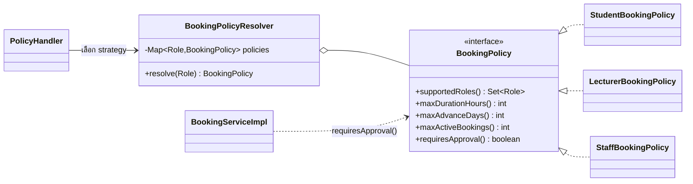
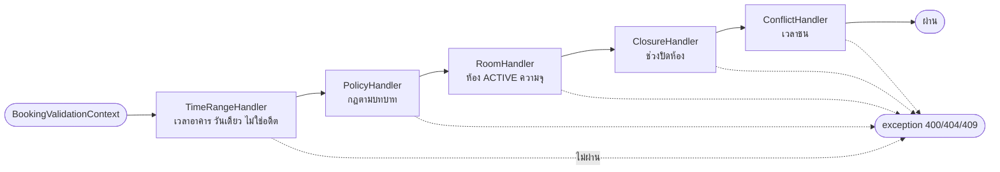
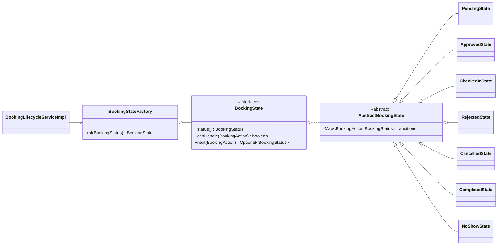
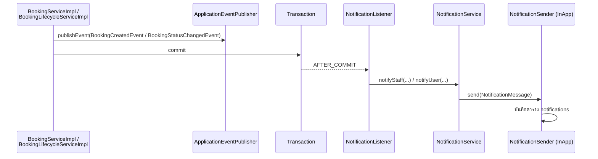

# Design Patterns

ระบบใช้ GoF Behavioral Pattern 4 ตัว แต่ละตัวแก้ปัญหาจริงของโดเมนการจองห้อง และมีเจ้าของโมดูลชัดเจน นอกจากนี้ใช้ Enterprise Pattern เป็นโครงหลักของทั้ง backend

| Pattern | ปัญหาที่แก้ | ที่อยู่ในโค้ด | ผู้รับผิดชอบ |
|---|---|---|---|
| [Strategy](#1-strategy--กฎการจองตามบทบาท) | กฎการจองต่างกันตามบทบาท | `service/policy/` | คนที่ 1 |
| [Chain of Responsibility](#2-chain-of-responsibility--ตรวจคำขอจองทีละขั้น) | ตรวจคำขอจองหลายกฎตามลำดับ | `service/validation/` | คนที่ 3 |
| [State](#3-state--วงจรสถานะการจอง) | การจองเปลี่ยนสถานะได้ต่างกันในแต่ละสถานะ | `service/state/` | คนที่ 4 |
| [Observer](#4-observer--แจ้งเตือนเมื่อการจองเปลี่ยน) | แจ้งเตือนโดยไม่ผูกโมดูลการจองกับโมดูลแจ้งเตือน | `event/`, `service/notification/` | คนที่ 5 |
| [Enterprise Patterns](#5-enterprise-patterns) | โครงสร้างหลักของ backend | ทุกโมดูล | ทุกคน |

---

## 1. Strategy — กฎการจองตามบทบาท

**ปัญหา:** นักศึกษา อาจารย์ และเจ้าหน้าที่ มีข้อจำกัดต่างกัน (ระยะเวลาต่อครั้ง จองล่วงหน้า จำนวนการจองที่ค้าง และต้องรออนุมัติหรือไม่) ถ้าเขียนเป็น `if (role == STUDENT) ... else if ...` กระจายในหลายที่ เพิ่มบทบาทใหม่ต้องไล่แก้ทุกจุด

**วิธีแก้:** แยกกฎของแต่ละบทบาทเป็น class ที่ implement interface เดียวกัน แล้วเลือก strategy จากบทบาทของผู้ใช้ตอน runtime



| Strategy | บทบาท | ชม. / ครั้ง | ล่วงหน้า | จองค้างได้ | รออนุมัติ |
|---|---|---|---|---|---|
| `StudentBookingPolicy` | STUDENT | 2 | 7 วัน | 2 | ✓ |
| `LecturerBookingPolicy` | LECTURER | 4 | 30 วัน | 5 | ✗ |
| `StaffBookingPolicy` | STAFF, ADMIN | 8 | 90 วัน | ไม่จำกัด | ✗ |

`BookingPolicyResolver` รับ `List<BookingPolicy>` ที่ Spring inject ให้ทั้งหมด แล้วสร้าง `Map<Role, BookingPolicy>` เอง:

```java
public BookingPolicyResolver(List<BookingPolicy> policyList) {
    this.policies = policyList.stream()
            .flatMap(policy -> policy.supportedRoles().stream().map(role -> Map.entry(role, policy)))
            .collect(Collectors.toUnmodifiableMap(Map.Entry::getKey, Map.Entry::getValue));
}
```

ผู้ใช้ strategy มี 2 ที่: `PolicyHandler` ใช้ตรวจระยะเวลา ล่วงหน้า และโควตา ส่วน `BookingServiceImpl` ใช้ `requiresApproval()` กำหนดสถานะเริ่มต้น (PENDING หรือ APPROVED)

**ข้อดี:** เพิ่มบทบาทใหม่ (เช่น ผู้ช่วยสอน) แค่เพิ่ม class ใหม่ที่ `@Component` ไม่ต้องแก้ resolver, handler หรือ service (Open/Closed) และ test แต่ละ policy แยกกันได้ (`BookingPolicyTest`, `BookingPolicyResolverTest`)

---

## 2. Chain of Responsibility — ตรวจคำขอจองทีละขั้น

**ปัญหา:** การจองหนึ่งครั้งต้องตรวจ 5 เรื่อง ถ้ารวมใน method เดียวจะยาว test ยาก และเพิ่มกฎใหม่ต้องแก้ method เดิม

**วิธีแก้:** แต่ละกฎเป็น handler ของตัวเอง ผ่านแล้วส่งต่อตัวถัดไป ไม่ผ่านโยน exception ทันที



```java
public abstract class BookingValidationHandler {
    private BookingValidationHandler next;

    public BookingValidationHandler setNext(BookingValidationHandler next) {
        this.next = next;
        return next;
    }

    public void validate(BookingValidationContext context) {
        check(context);
        if (next != null) {
            next.validate(context);
        }
    }

    protected abstract void check(BookingValidationContext context);
}
```

`BookingValidationChain` ประกอบ chain ใน constructor: `timeRangeHandler.setNext(policyHandler).setNext(roomHandler).setNext(closureHandler).setNext(conflictHandler)` เรียงกฎที่ไม่ต้องใช้ฐานข้อมูลไว้ก่อน `validate()` ของ handler ฐานเป็น Template Method คือกำหนดขั้นตอน "ตรวจ แล้วส่งต่อ" ส่วนแต่ละ handler กำหนดแค่ `check()`

ข้อมูลที่ handler ส่งต่อกันอยู่ใน `BookingValidationContext` เช่น `PolicyHandler` ใส่ `policy` และ `RoomHandler` ใส่ `room` ให้ `BookingServiceImpl` ใช้ต่อโดยไม่ต้อง query ซ้ำ

**ข้อดี:** เพิ่มกฎใหม่ (เช่น ห้ามจองวันหยุดราชการ) ด้วยการเขียน handler ใหม่แล้วต่อเข้า chain ไม่ต้องแก้ handler เดิม, test แต่ละกฎแยกกัน (`TimeRangeHandlerTest`, `PolicyHandlerTest`, `RoomHandlerTest`, `ClosureHandlerTest`, `ConflictHandlerTest`) และใช้ chain เดียวกันทั้งตอนสร้างและแก้ไขการจอง

**การทำงานพร้อมกัน:** chain ตรวจจากข้อมูลในฐานข้อมูล ถ้ามี 2 คำขอเข้ามาพร้อมกัน ทั้งคู่อาจผ่าน `ConflictHandler` ก่อนอีกฝ่ายบันทึก `BookingServiceImpl` จึงล็อกแถวผู้ใช้และห้อง (`SELECT ... FOR UPDATE`) ก่อนเรียก chain ทุกครั้ง พิสูจน์ด้วย `BookingConcurrencyIntegrationTest` (ถ้าเอาล็อกออก 5 คำขอพร้อมกันจองสำเร็จทั้ง 5 รายการ พอใส่ล็อกสำเร็จ 1 รายการ)

---

## 3. State — วงจรสถานะการจอง

**ปัญหา:** action ที่ทำได้ขึ้นกับสถานะปัจจุบัน เช่น อนุมัติได้เฉพาะตอน PENDING, check-in ได้เฉพาะตอน APPROVED ถ้าใช้ `switch` ซ้อนกัน (สถานะ × action) จะอ่านยากและแก้ผิดง่าย

**วิธีแก้:** แต่ละสถานะเป็น object ที่รู้ว่าตัวเองรับ action อะไรและไปสถานะไหน service ถามจาก state แทนการเขียนเงื่อนไขเอง



```java
@Component
public class PendingState extends AbstractBookingState {
    public PendingState() {
        super(BookingStatus.PENDING, Map.of(
                BookingAction.APPROVE, BookingStatus.APPROVED,
                BookingAction.REJECT, BookingStatus.REJECTED,
                BookingAction.CANCEL, BookingStatus.CANCELLED));
    }
}
```

`BookingStateFactory` รับ state ทุกตัวจาก Spring และตรวจตอนเริ่มระบบว่ามีครบทุก `BookingStatus` ถ้าขาดตัวใดระบบจะไม่ start ใน `changeStatus` ใช้ state แบบนี้:

```java
BookingState state = stateFactory.of(booking.getStatus());
if (!state.canHandle(action)) {
    throw new InvalidBookingStateException(booking.getStatus(), action);   // 409
}
// ... ตรวจสิทธิ์ เวลา และห้อง ...
BookingStatus to = state.next(action).orElseThrow(...);
booking.changeStatus(to, changedBy, note, now);                          // บันทึกประวัติในตัว
```

**ข้อดี:** กฎการเปลี่ยนสถานะอยู่ที่เดียวต่อสถานะ ดูเป็นตาราง test ได้ครบทุกคู่ (`BookingStateTransitionTest` 42 กรณี = 7 สถานะ × 6 action), ใช้ร่วมกับ `getAllowedActions` ที่บอกหน้าเว็บว่าควรแสดงปุ่มอะไร และ Scheduler ใช้ state เดียวกันกับผู้ใช้

แผนภาพการเปลี่ยนสถานะทั้งหมดอยู่ใน [diagrams/state-diagram.md](diagrams/state-diagram.md)

---

## 4. Observer — แจ้งเตือนเมื่อการจองเปลี่ยน

**ปัญหา:** เมื่อสร้างการจองหรือเปลี่ยนสถานะต้องแจ้งเตือนคนที่เกี่ยวข้อง ถ้าโมดูลการจองเรียก `NotificationService` โดยตรง จะผูกกันแน่น และถ้าสร้างแจ้งเตือนล้มเหลวอาจทำให้การจอง rollback

**วิธีแก้:** โมดูลการจอง (subject) แค่ประกาศ event ผ่าน `ApplicationEventPublisher` ของ Spring ส่วน `NotificationListener` (observer) รับ event ไปทำงานเองหลัง transaction commit



```java
@TransactionalEventListener(phase = TransactionPhase.AFTER_COMMIT)
public void onStatusChanged(BookingStatusChangedEvent event) {
    Optional.ofNullable(OWNER_NOTIFICATIONS.get(event.toStatus())).ifPresent(type -> {
        String message = "การจองห้อง " + event.roomCode() + " วันที่ " + format(event.startTime()) + " "
                + STATUS_TEXT.get(event.toStatus()) + ...;
        safely(() -> notificationService.notifyUser(event.userId(), event.bookingId(), type, message));
    });
}
```

| Event | ผู้ประกาศ | ผู้รับแจ้งเตือน | ประเภท |
|---|---|---|---|
| `BookingCreatedEvent` | `BookingServiceImpl.create` | เจ้าหน้าที่และผู้ดูแลระบบทุกคน | BOOKING_CREATED |
| `BookingStatusChangedEvent` → APPROVED | `BookingLifecycleServiceImpl` | ผู้จอง | BOOKING_APPROVED |
| → REJECTED (พร้อมเหตุผล) | 〃 | ผู้จอง | BOOKING_REJECTED |
| → CANCELLED | 〃 | ผู้จอง | BOOKING_CANCELLED |
| → NO_SHOW (จาก Scheduler) | 〃 | ผู้จอง | BOOKING_NO_SHOW |

**ข้อดี:**
- โมดูลการจองไม่ import อะไรจากโมดูลแจ้งเตือนเลย
- `AFTER_COMMIT` ทำให้ไม่มีแจ้งเตือนของการจองที่ rollback และ `safely()` ทำให้แจ้งเตือนที่ล้มเหลวไม่ทำให้ผู้ใช้เห็น error ทั้งที่การจองสำเร็จแล้ว
- `NotificationService` ส่งผ่าน `List<NotificationSender>` เพิ่มช่องทาง (อีเมล, LINE) ได้ด้วยการเพิ่ม class ที่ implement `NotificationSender`
- `NotificationFlowIntegrationTest` ทดสอบตั้งแต่สร้างการจองจริง อนุมัติ จนถึงแจ้งเตือนถึงคนที่ถูกต้อง

---

## 5. Enterprise Patterns

| Pattern | การใช้ในระบบ |
|---|---|
| Layered Architecture | `controller → service → repository → domain` แต่ละ layer เรียกเฉพาะ layer ถัดลงไป Controller ไม่เรียก repository |
| MVC | Spring MVC (`@RestController`) ฝั่ง backend และ Next.js page/component ฝั่ง frontend |
| Repository | Spring Data JPA (`JpaRepository`, `JpaSpecificationExecutor`) + query เฉพาะเรื่อง เช่น `existsOverlap`, `findAllInRange` |
| Specification | ค้นหา/กรองห้องและการจองแบบประกอบเงื่อนไข (`RoomSpecifications`, `BookingSpecifications`) |
| Service Layer | business logic และ `@Transactional` อยู่ใน `*ServiceImpl` ทุกตัวมี interface |
| DTO + Mapper | request/response เป็น `record` แปลงกับ entity ผ่าน `*Mapper` ไม่ส่ง entity ออก API |
| Dependency Injection | constructor injection (`@RequiredArgsConstructor` + `final`) ทุก class ไม่มี field injection |
| Registry / Factory | `BookingPolicyResolver` และ `BookingStateFactory` สร้าง map จาก bean ทั้งหมดที่ Spring inject |
| Template Method | `BookingValidationHandler.validate()` กำหนดขั้นตอน ส่วน subclass กำหนด `check()` |
| Pessimistic Locking | `SELECT ... FOR UPDATE` ก่อนตรวจกฎ (การจอง, เปลี่ยนสถานะ, ปิดห้อง) กันคำขอพร้อมกันผ่านการตรวจทั้งคู่ |
| Global Exception Handler | `@RestControllerAdvice` แปลง exception ทุกชนิดเป็น `ErrorResponse` รูปแบบเดียวกัน |
