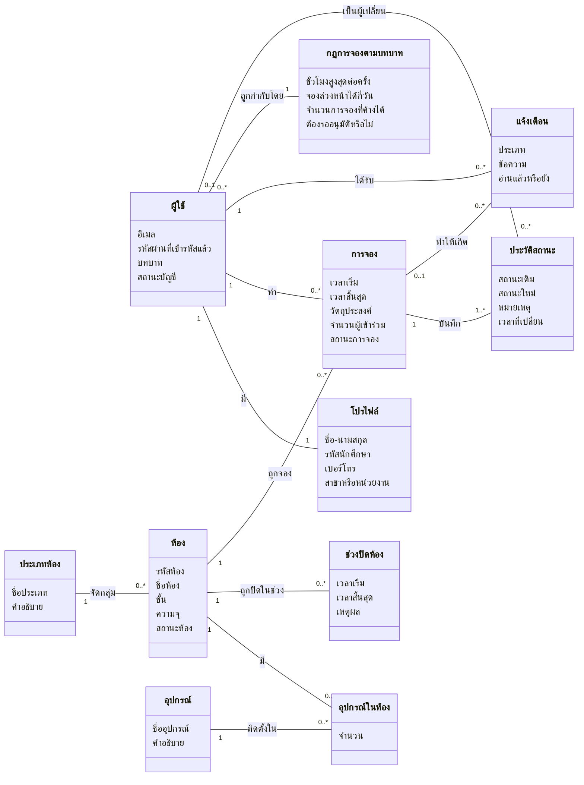

# Conceptual Class Diagram (Domain Model)

แบบจำลองแนวคิดของโดเมนการจองห้อง แสดงเฉพาะแนวคิด คุณลักษณะสำคัญ และความสัมพันธ์ ยังไม่ลงรายละเอียดการเขียนโปรแกรม (ไม่มี method, ชนิดข้อมูล หรือคลาสของ framework) ฉบับที่ลงรายละเอียดอยู่ใน [class-diagram.md](class-diagram.md)

ห้องกับอุปกรณ์เป็นความสัมพันธ์ Many-to-Many ที่มีข้อมูลของตัวเอง (จำนวน) จึงแยกเป็นแนวคิด "อุปกรณ์ในห้อง" ทำหน้าที่เป็น association class

## คำอธิบายแนวคิด

| แนวคิด | ความหมาย | กฎทางธุรกิจที่เกี่ยวข้อง |
|---|---|---|
| ผู้ใช้ | บัญชีที่ใช้ login ด้วยอีเมล | บทบาท 4 แบบ: นักศึกษา อาจารย์ เจ้าหน้าที่ ผู้ดูแลระบบ, บัญชีที่ปิดใช้งานแล้ว login ไม่ได้ |
| โปรไฟล์ | ข้อมูลส่วนตัวของผู้ใช้ แยกจากบัญชี | ผู้ใช้ 1 คนมีโปรไฟล์ 1 ชุด (One-to-One) |
| ห้อง | ห้องในอาคาร SC09 ที่จองได้ | รหัสห้องไม่ซ้ำ, ความจุมากกว่า 0, สถานะ เปิดให้จอง / ปิดซ่อมบำรุง / เลิกใช้งาน |
| ประเภทห้อง | ห้องบรรยาย ห้องปฏิบัติการคอมพิวเตอร์ ห้องประชุม ห้องโถงอเนกประสงค์ | ลบประเภทที่ยังมีห้องใช้อยู่ไม่ได้ |
| อุปกรณ์ / อุปกรณ์ในห้อง | อุปกรณ์ที่มีในห้อง พร้อมจำนวน | ห้องหนึ่งมีอุปกรณ์ชนิดเดียวกันได้ 1 รายการ (ระบุจำนวน) |
| ช่วงปิดห้อง | ช่วงเวลาที่ห้องใช้ไม่ได้ เช่น ซ่อมบำรุง | ช่วงปิดของห้องเดียวกันห้ามทับกัน และห้ามทับการจองที่ยังใช้งาน |
| การจอง | คำขอใช้ห้องในช่วงเวลาหนึ่ง | ห้องเดียวกันห้ามจองเวลาซ้อน, อยู่ในเวลาเปิดอาคาร 08:00–22:00 และภายในวันเดียว |
| ประวัติสถานะ | บันทึกทุกครั้งที่สถานะการจองเปลี่ยน | ผู้เปลี่ยนว่างได้ หมายถึงระบบเปลี่ยนเอง (Scheduler) |
| แจ้งเตือน | ข้อความถึงผู้ใช้เมื่อมีเหตุการณ์ของการจอง | สร้างหลังบันทึกการจองสำเร็จแล้วเท่านั้น |
| กฎการจองตามบทบาท | ข้อจำกัดที่ต่างกันตามบทบาท | นักศึกษา 2 ชม. / 7 วัน / 2 รายการ / รออนุมัติ, อาจารย์ 4 ชม. / 30 วัน / 5 รายการ, เจ้าหน้าที่และผู้ดูแลระบบ 8 ชม. / 90 วัน / ไม่จำกัด |

"กฎการจองตามบทบาท" ไม่ได้เก็บในฐานข้อมูล แต่เป็นแนวคิดสำคัญของโดเมน ในโค้ดเป็น Strategy (`BookingPolicy`) ดู [design-patterns.md](../design-patterns.md)
