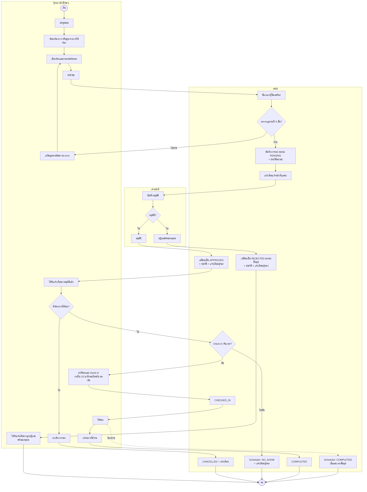
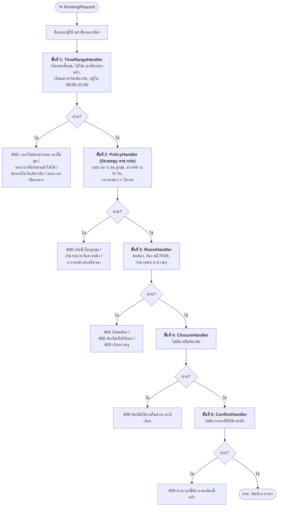
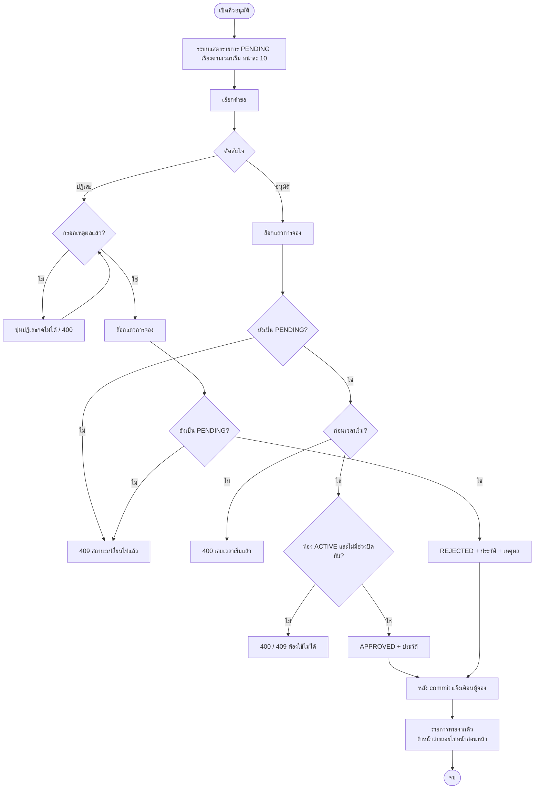

# Activity Diagrams

## 1. กระบวนการจองห้องตั้งแต่ต้นจนจบ

แยกช่องตามผู้กระทำ (swimlane) ด้วย subgraph

กรณีอาจารย์ เจ้าหน้าที่ และผู้ดูแลระบบ ขั้น "บันทึกการจอง" จะได้สถานะ APPROVED ทันที (ข้ามคิวอนุมัติ) เพราะ `requiresApproval()` ของ policy เป็น false ส่วนกรณีถูกปฏิเสธ การจองเป็น REJECTED ซึ่งเป็นสถานะสิ้นสุด กระบวนการจบหลังผู้จองได้รับแจ้งเตือน (ถ้ายังต้องการห้องให้ส่งคำขอใหม่) มีเพียงการจองที่ APPROVED เท่านั้นที่ไปต่อขั้น check-in

## 2. การตรวจกฎการจอง (Chain of Responsibility)

ตรวจกฎที่ไม่ต้องใช้ฐานข้อมูลก่อน (ขั้น 1–2 บางส่วน) แล้วค่อย query เพื่อตัดคำขอที่ผิดกฎชัดเจนออกเร็วที่สุด

## 3. การอนุมัติคำขอของเจ้าหน้าที่

