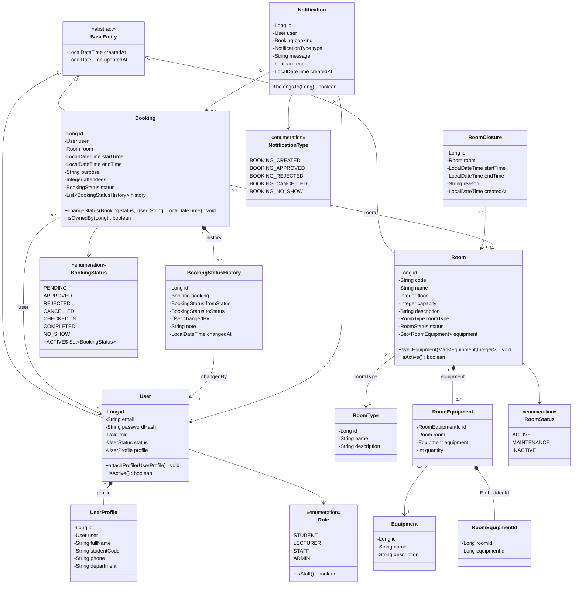
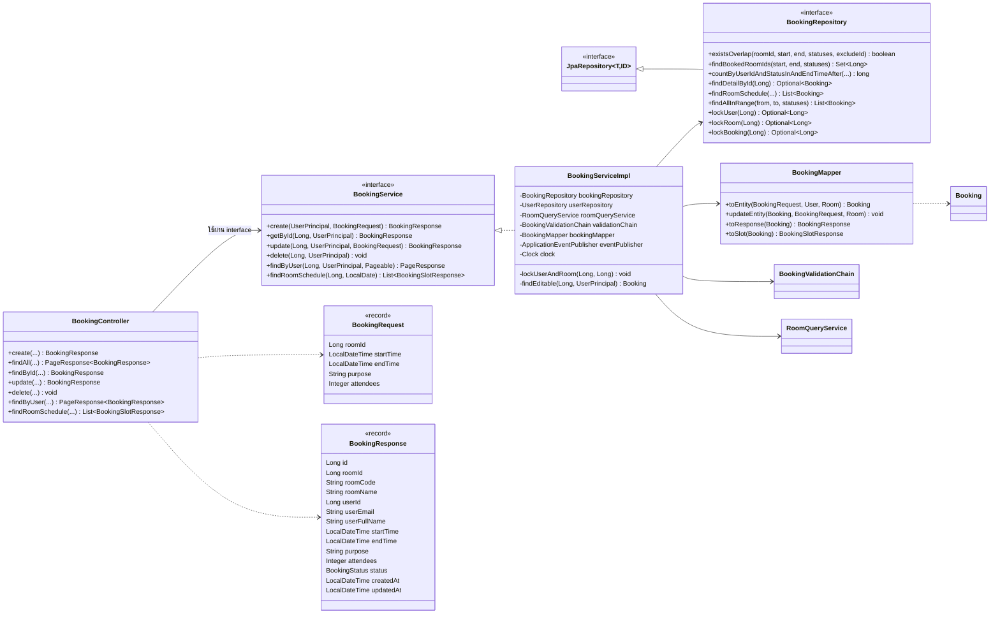
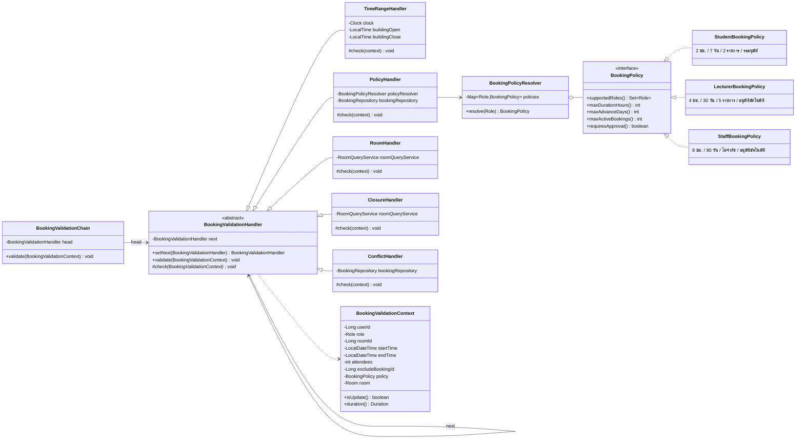
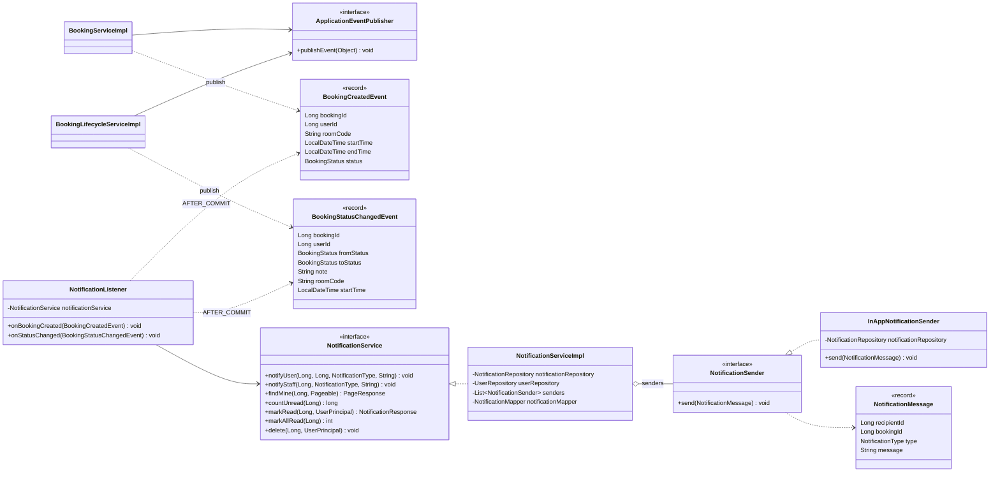
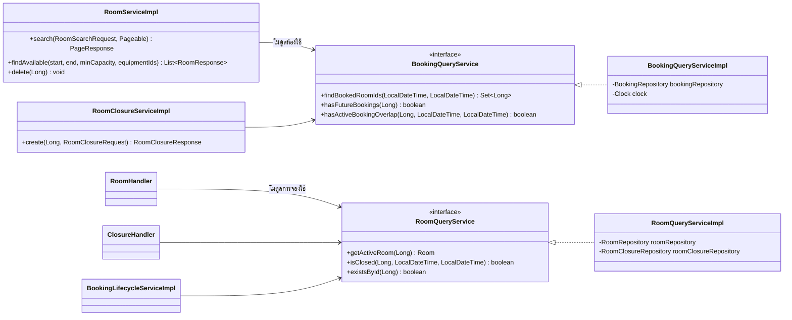

# Class Diagram (Design Class Diagram)

Class Diagram ระดับออกแบบ ใช้ชื่อ class, field และ method ตามโค้ดจริงใน `code/backend/src/main/java/com/example/cp_room_booking/` แบ่งเป็น 6 ภาพตามโมดูล เพื่อไม่ให้ภาพเดียวแน่นเกินไป

| ภาพ | เนื้อหา | ผู้รับผิดชอบโมดูล |
|---|---|---|
| 1 | Domain Entity และ Enum | ทุกคน |
| 2 | Layered Architecture ของโมดูลการจอง | คนที่ 3 |
| 3 | Chain of Responsibility + Strategy (ตรวจกฎการจอง) | คนที่ 3, คนที่ 1 |
| 4 | State Pattern (วงจรสถานะการจอง) | คนที่ 4 |
| 5 | Observer Pattern (แจ้งเตือน) | คนที่ 5 |
| 6 | Interface ระหว่างโมดูลห้องกับโมดูลการจอง (ISP) | คนที่ 2, คนที่ 3 |

## 1. Domain Entity และ Enum

จุดออกแบบ:
- `Booking.changeStatus(...)` เปลี่ยนสถานะพร้อมเพิ่ม `BookingStatusHistory` ในตัว entity เอง ประวัติจึงไม่หลุดจากการเปลี่ยนสถานะ
- `RoomEquipment` เป็น entity แยก (ไม่ใช้ `@ManyToMany` ตรง ๆ) เพราะต้องเก็บ `quantity` ใช้ composite key `RoomEquipmentId` กับ `@MapsId`
- ทุกความสัมพันธ์ `@ManyToOne` ใช้ `FetchType.LAZY` และดึงข้อมูลที่ต้องใช้ผ่าน `@EntityGraph` หรือ `join fetch` ใน repository

## 2. Layered Architecture ของโมดูลการจอง

Controller รับและคืนเฉพาะ DTO (`record`) ไม่ส่ง entity ออกนอก service ส่วน service แปลงด้วย mapper ทุกครั้ง โมดูลอื่น (ห้อง ผู้ใช้ แจ้งเตือน สถิติ) ใช้โครงสร้างเดียวกัน: `XController → XService (interface) → XServiceImpl → XRepository`

## 3. Chain of Responsibility + Strategy (ตรวจกฎการจอง)

ลำดับใน chain: `TimeRangeHandler → PolicyHandler → RoomHandler → ClosureHandler → ConflictHandler` ตรวจกฎที่ไม่ต้องใช้ฐานข้อมูลก่อน แล้วค่อย query `StaffBookingPolicy` รองรับทั้ง `STAFF` และ `ADMIN`

## 4. State Pattern (วงจรสถานะการจอง)

```mermaid
classDiagram
    direction LR

    class BookingLifecycleService {
        <<interface>>
        +changeStatus(Long, BookingAction, String, UserPrincipal) BookingResponse
        +getHistory(Long, UserPrincipal) List~BookingHistoryResponse~
        +getAllowedActions(Long, UserPrincipal) AllowedActionsResponse
        +markNoShows() int
        +completeFinished() int
    }
    class BookingLifecycleServiceImpl {
        -BookingRepository bookingRepository
        -BookingLifecycleRepository lifecycleRepository
        -RoomQueryService roomQueryService
        -BookingStateFactory stateFactory
        -ApplicationEventPublisher eventPublisher
        -Clock clock
        -isPermitted(BookingAction, Booking, UserPrincipal) boolean
        -timeViolation(BookingAction, Booking, LocalDateTime) Optional~String~
        -ensureRoomUsable(Booking) void
        -lockAndStillIn(Booking, BookingStatus) boolean
        -transition(...) void
    }
    class BookingLifecycleRepository {
        <<interface>>
        +findByStatusAndStartTimeBefore(status, threshold) List~Booking~
        +findByStatusAndEndTimeBefore(status, threshold) List~Booking~
        +lockById(Long) Optional~Long~
        +findStatusById(Long) Optional~BookingStatus~
    }
    class BookingStateFactory {
        -Map~BookingStatus,BookingState~ states
        +of(BookingStatus) BookingState
    }
    class BookingState {
        <<interface>>
        +status() BookingStatus
        +canHandle(BookingAction) boolean
        +next(BookingAction) Optional~BookingStatus~
    }
    class AbstractBookingState {
        <<abstract>>
        -BookingStatus status
        -Map~BookingAction,BookingStatus~ transitions
    }
    class PendingState
    class ApprovedState
    class CheckedInState
    class RejectedState
    class CancelledState
    class CompletedState
    class NoShowState
    class BookingStatusScheduler {
        +closeOverdueBookings() void
    }
    class BookingAction {
        <<enumeration>>
        APPROVE
        REJECT
        CANCEL
        CHECK_IN
        COMPLETE
        MARK_NO_SHOW
    }

    BookingLifecycleService <|.. BookingLifecycleServiceImpl
    BookingLifecycleServiceImpl --> BookingStateFactory
    BookingLifecycleServiceImpl --> BookingLifecycleRepository
    BookingStateFactory o-- BookingState
    BookingState <|.. AbstractBookingState
    AbstractBookingState <|-- PendingState
    AbstractBookingState <|-- ApprovedState
    AbstractBookingState <|-- CheckedInState
    AbstractBookingState <|-- RejectedState
    AbstractBookingState <|-- CancelledState
    AbstractBookingState <|-- CompletedState
    AbstractBookingState <|-- NoShowState
    BookingState ..> BookingAction
    BookingStatusScheduler --> BookingLifecycleService : ทุก 1 นาที
```

การเปลี่ยนสถานะที่อนุญาตของแต่ละ state ดูใน [state-diagram.md](state-diagram.md)

## 5. Observer Pattern (แจ้งเตือน)

โมดูลการจองไม่รู้จักโมดูลแจ้งเตือนเลย รู้แค่ event ส่วน `NotificationSender` เปิดให้เพิ่มช่องทางใหม่ (อีเมล, LINE) ได้โดยไม่แก้ `NotificationService`

## 6. Interface ระหว่างโมดูลห้องกับโมดูลการจอง

แต่ละโมดูลเห็นอีกโมดูลผ่าน interface เล็ก ๆ ที่มีเฉพาะ method ที่ต้องใช้ (Interface Segregation) ไม่ต้องรู้จัก repository ของกันและกัน และไม่เกิด dependency วนระหว่าง `RoomService` กับ `BookingService`
