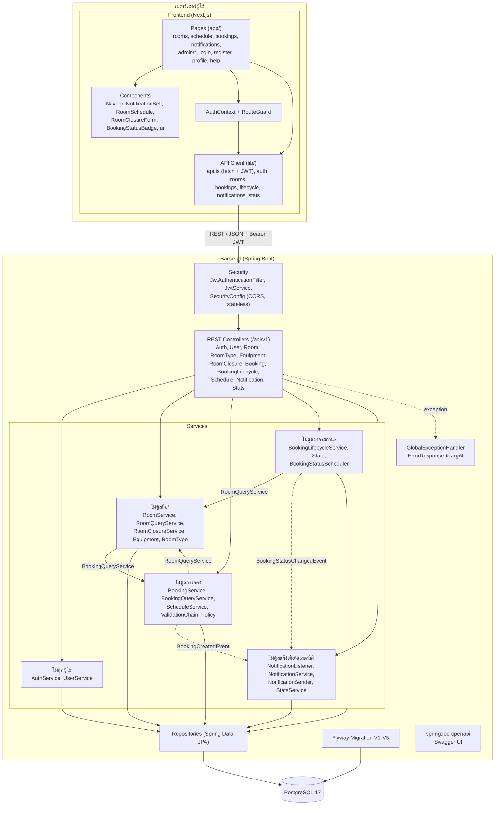
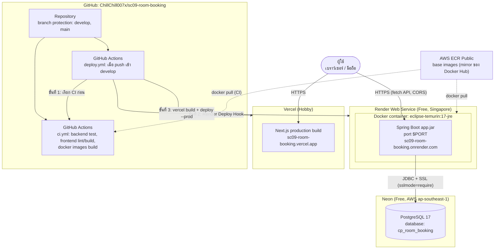
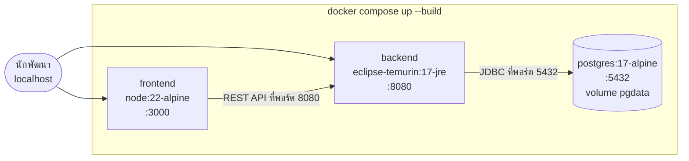

# Component Diagram และ Deployment Diagram

## 1. Component Diagram

| Component | หน้าที่ | ผู้รับผิดชอบ |
|---|---|---|
| Security + โมดูลผู้ใช้ | สมัคร login ออก JWT ตรวจสิทธิ์ จัดการผู้ใช้และโปรไฟล์ | คนที่ 1 |
| โมดูลห้อง | CRUD ห้อง ประเภท อุปกรณ์ ค้นหา/กรอง/แบ่งหน้า ห้องว่าง ช่วงปิดห้อง | คนที่ 2 |
| โมดูลการจอง | CRUD การจอง ตรวจกฎ (Chain + Strategy) ตรวจเวลาชน ตารางการใช้ห้อง | คนที่ 3 (Policy: คนที่ 1) |
| โมดูลวงจรสถานะ | อนุมัติ ปฏิเสธ ยกเลิก check-in ประวัติสถานะ Scheduler | คนที่ 4 |
| โมดูลแจ้งเตือนและสถิติ | Observer สร้างแจ้งเตือน API แจ้งเตือน สถิติ | คนที่ 5 |
| GlobalExceptionHandler | แปลง exception เป็น HTTP status + `ErrorResponse` (400/401/403/404/409/500) | คนที่ 1 |

โมดูลคุยกันผ่าน interface เล็ก (`RoomQueryService`, `BookingQueryService`) หรือผ่าน event เท่านั้น ไม่เรียก repository ของโมดูลอื่นโดยตรง

## 2. Deployment Diagram (Production)

| Node | เทคโนโลยี | ค่าที่ตั้ง (ไม่ใส่ค่าลับ) |
|---|---|---|
| Vercel | Next.js build | `NEXT_PUBLIC_API_URL` = URL ของ backend (ฝังตอน build) |
| Render | Docker (Dockerfile แบบ multi-stage ใน `code/backend`) | `DB_URL`, `DB_USERNAME`, `DB_PASSWORD`, `JWT_SECRET`, `CORS_ALLOWED_ORIGINS`, Health check `/v3/api-docs`, Auto-Deploy ปิด |
| Neon | PostgreSQL 17 (direct connection ไม่ใช้ pooler เพราะ Flyway) | database `cp_room_booking` |
| GitHub Actions | `ci.yml`, `deploy.yml` | Secrets: `RENDER_DEPLOY_HOOK_URL`, `BACKEND_URL`, `VERCEL_TOKEN`, `VERCEL_ORG_ID`, `VERCEL_PROJECT_ID` |

ข้อจำกัดของแผนฟรี: Render หลับเมื่อไม่มีคนใช้ 15 นาที request แรกหลังจากนั้นช้าประมาณ 1 นาที และ Neon หยุด compute เมื่อไม่ได้ใช้

## 3. Deployment บนเครื่องนักพัฒนา (Docker Compose)

backend รอ postgres ผ่าน healthcheck (`pg_isready`) ก่อนเริ่ม ส่วนการพัฒนาแบบไม่ใช้ Docker ใช้ `./mvnw spring-boot:run` กับ `npm run dev` ได้ ดู README
