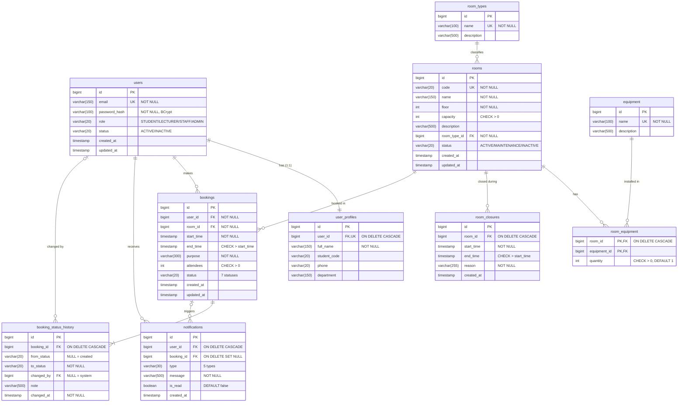

# ER Diagram และ Data Dictionary

โครงสร้างฐานข้อมูล PostgreSQL 17 สร้างด้วย Flyway migration 5 ไฟล์ใน `code/backend/src/main/resources/db/migration/` มี 10 ตาราง ครบความสัมพันธ์ One-to-One, One-to-Many และ Many-to-Many

| Migration | ตาราง | ผู้รับผิดชอบ |
|---|---|---|
| `V1__users.sql` | `users`, `user_profiles` + บัญชีทดสอบ 5 บัญชี | คนที่ 1 |
| `V2__rooms.sql` | `room_types`, `rooms`, `equipment`, `room_equipment`, `room_closures` + ข้อมูลห้อง 16 ห้อง | คนที่ 2 |
| `V3__bookings.sql` | `bookings` + การจองตัวอย่าง | คนที่ 3 |
| `V4__booking_status_history.sql` | `booking_status_history` + ประวัติของการจองตัวอย่าง | คนที่ 4 |
| `V5__notifications.sql` | `notifications` + แจ้งเตือนตัวอย่าง | คนที่ 5 |

## ER Diagram

## ความสัมพันธ์

| ความสัมพันธ์ | ชนิด | การ implement | เหตุผลของ ON DELETE |
|---|---|---|---|
| `users` – `user_profiles` | One-to-One | `user_profiles.user_id` UNIQUE + FK | CASCADE: ลบผู้ใช้แล้วโปรไฟล์หายตาม |
| `users` – `bookings` | One-to-Many | `bookings.user_id` FK | ไม่ cascade: ห้ามลบผู้ใช้ที่มีการจอง ให้ปิดใช้งาน (`status = INACTIVE`) แทน |
| `rooms` – `bookings` | One-to-Many | `bookings.room_id` FK | ไม่ cascade: ห้ามลบห้องที่มีการจอง ให้เปลี่ยนเป็น `INACTIVE` แทน |
| `room_types` – `rooms` | One-to-Many | `rooms.room_type_id` FK | ไม่ cascade: ลบประเภทที่ยังมีห้องไม่ได้ |
| `rooms` – `equipment` | Many-to-Many | ตารางเชื่อม `room_equipment` (PK คู่) มี `quantity` | CASCADE ฝั่งห้อง |
| `rooms` – `room_closures` | One-to-Many | `room_closures.room_id` FK | CASCADE |
| `bookings` – `booking_status_history` | One-to-Many | `booking_status_history.booking_id` FK | CASCADE: ลบการจองที่ยัง PENDING แล้วประวัติหายตาม |
| `users` – `booking_status_history` | One-to-Many (optional) | `changed_by` FK เป็น NULL ได้ | NULL = Scheduler เปลี่ยนเอง |
| `users` – `notifications` | One-to-Many | `notifications.user_id` FK | CASCADE |
| `bookings` – `notifications` | One-to-Many (optional) | `notifications.booking_id` FK เป็น NULL ได้ | SET NULL: ลบการจองแล้วแจ้งเตือนยังอยู่ |

## Data Dictionary

### users
| คอลัมน์ | ชนิด | ข้อกำหนด | คำอธิบาย |
|---|---|---|---|
| id | BIGINT | PK, IDENTITY | รหัสผู้ใช้ |
| email | VARCHAR(150) | NOT NULL, UNIQUE (`uk_users_email`) | อีเมลที่ใช้ login เก็บเป็นตัวพิมพ์เล็ก |
| password_hash | VARCHAR(100) | NOT NULL | รหัสผ่านที่ hash ด้วย BCrypt |
| role | VARCHAR(20) | NOT NULL, CHECK IN (STUDENT, LECTURER, STAFF, ADMIN) | บทบาท |
| status | VARCHAR(20) | NOT NULL, DEFAULT 'ACTIVE', CHECK IN (ACTIVE, INACTIVE) | สถานะบัญชี |
| created_at, updated_at | TIMESTAMP | NOT NULL, DEFAULT CURRENT_TIMESTAMP | เวลาสร้าง / แก้ไขล่าสุด |

### user_profiles
| คอลัมน์ | ชนิด | ข้อกำหนด | คำอธิบาย |
|---|---|---|---|
| id | BIGINT | PK, IDENTITY | รหัสโปรไฟล์ |
| user_id | BIGINT | NOT NULL, UNIQUE, FK → users.id ON DELETE CASCADE | เจ้าของโปรไฟล์ (1:1) |
| full_name | VARCHAR(150) | NOT NULL | ชื่อ-นามสกุล |
| student_code | VARCHAR(20) | | รหัสนักศึกษา |
| phone | VARCHAR(20) | | เบอร์โทร |
| department | VARCHAR(150) | | สาขาหรือหน่วยงาน |

### room_types
| คอลัมน์ | ชนิด | ข้อกำหนด | คำอธิบาย |
|---|---|---|---|
| id | BIGINT | PK, IDENTITY | รหัสประเภท |
| name | VARCHAR(100) | NOT NULL, UNIQUE | ชื่อประเภท (ห้องบรรยาย, ห้องปฏิบัติการคอมพิวเตอร์, ห้องประชุม, ห้องโถงอเนกประสงค์) |
| description | VARCHAR(500) | | คำอธิบาย |

### rooms
| คอลัมน์ | ชนิด | ข้อกำหนด | คำอธิบาย |
|---|---|---|---|
| id | BIGINT | PK, IDENTITY | รหัสห้องภายในระบบ |
| code | VARCHAR(20) | NOT NULL, UNIQUE | รหัสห้อง เช่น SC09-9226 |
| name | VARCHAR(150) | NOT NULL | ชื่อห้อง |
| floor | INTEGER | NOT NULL, INDEX | ชั้น (1, 2, 4, 5, 6) |
| capacity | INTEGER | NOT NULL, CHECK > 0 | ความจุ (คน) |
| description | VARCHAR(500) | | คำอธิบาย |
| room_type_id | BIGINT | NOT NULL, FK → room_types.id, INDEX | ประเภทห้อง |
| status | VARCHAR(20) | NOT NULL, DEFAULT 'ACTIVE', CHECK IN (ACTIVE, MAINTENANCE, INACTIVE) | เปิดให้จอง / ปิดซ่อมบำรุง / เลิกใช้งาน |
| created_at, updated_at | TIMESTAMP | NOT NULL | เวลาสร้าง / แก้ไขล่าสุด |

### equipment
| คอลัมน์ | ชนิด | ข้อกำหนด | คำอธิบาย |
|---|---|---|---|
| id | BIGINT | PK, IDENTITY | รหัสอุปกรณ์ |
| name | VARCHAR(100) | NOT NULL, UNIQUE | ชื่ออุปกรณ์ (โปรเจกเตอร์, คอมพิวเตอร์, ไวท์บอร์ด, ไมโครโฟน, Smart TV) |
| description | VARCHAR(500) | | คำอธิบาย |

### room_equipment
| คอลัมน์ | ชนิด | ข้อกำหนด | คำอธิบาย |
|---|---|---|---|
| room_id | BIGINT | PK, FK → rooms.id ON DELETE CASCADE | ห้อง |
| equipment_id | BIGINT | PK, FK → equipment.id, INDEX | อุปกรณ์ |
| quantity | INTEGER | NOT NULL, DEFAULT 1, CHECK > 0 | จำนวน |

### room_closures
| คอลัมน์ | ชนิด | ข้อกำหนด | คำอธิบาย |
|---|---|---|---|
| id | BIGINT | PK, IDENTITY | รหัสช่วงปิด |
| room_id | BIGINT | NOT NULL, FK → rooms.id ON DELETE CASCADE | ห้อง |
| start_time | TIMESTAMP | NOT NULL, INDEX (room_id, start_time) | เวลาเริ่มปิด |
| end_time | TIMESTAMP | NOT NULL, CHECK end_time > start_time | เวลาสิ้นสุด |
| reason | VARCHAR(255) | NOT NULL | เหตุผล |
| created_at | TIMESTAMP | NOT NULL | เวลาสร้าง |

### bookings
| คอลัมน์ | ชนิด | ข้อกำหนด | คำอธิบาย |
|---|---|---|---|
| id | BIGINT | PK, IDENTITY | รหัสการจอง |
| user_id | BIGINT | NOT NULL, FK → users.id, INDEX | ผู้จอง |
| room_id | BIGINT | NOT NULL, FK → rooms.id | ห้อง |
| start_time | TIMESTAMP | NOT NULL, INDEX (room_id, start_time, end_time) | เวลาเริ่ม |
| end_time | TIMESTAMP | NOT NULL, CHECK end_time > start_time | เวลาสิ้นสุด |
| purpose | VARCHAR(300) | NOT NULL | วัตถุประสงค์ |
| attendees | INTEGER | NOT NULL, CHECK > 0 | จำนวนผู้เข้าร่วม |
| status | VARCHAR(20) | NOT NULL, INDEX, CHECK IN (PENDING, APPROVED, REJECTED, CANCELLED, CHECKED_IN, COMPLETED, NO_SHOW) | สถานะ |
| created_at, updated_at | TIMESTAMP | NOT NULL | เวลาสร้าง / แก้ไขล่าสุด |

index `idx_bookings_room_time (room_id, start_time, end_time)` ใช้กับการตรวจเวลาชน ซึ่งค้นด้วย `room_id` แล้วเทียบ `start_time < :end AND end_time > :start`

### booking_status_history
| คอลัมน์ | ชนิด | ข้อกำหนด | คำอธิบาย |
|---|---|---|---|
| id | BIGINT | PK, IDENTITY | รหัสประวัติ |
| booking_id | BIGINT | NOT NULL, FK → bookings.id ON DELETE CASCADE, INDEX (booking_id, changed_at) | การจอง |
| from_status | VARCHAR(20) | | สถานะเดิม (NULL = เพิ่งสร้าง) |
| to_status | VARCHAR(20) | NOT NULL | สถานะใหม่ |
| changed_by | BIGINT | FK → users.id | ผู้เปลี่ยน (NULL = Scheduler) |
| note | VARCHAR(500) | | หมายเหตุ เช่น เหตุผลที่ปฏิเสธ |
| changed_at | TIMESTAMP | NOT NULL | เวลาที่เปลี่ยน |

### notifications
| คอลัมน์ | ชนิด | ข้อกำหนด | คำอธิบาย |
|---|---|---|---|
| id | BIGINT | PK, IDENTITY | รหัสแจ้งเตือน |
| user_id | BIGINT | NOT NULL, FK → users.id ON DELETE CASCADE, INDEX (user_id, is_read) | ผู้รับ |
| booking_id | BIGINT | FK → bookings.id ON DELETE SET NULL, INDEX | การจองที่เกี่ยวข้อง |
| type | VARCHAR(30) | NOT NULL, CHECK IN (BOOKING_CREATED, BOOKING_APPROVED, BOOKING_REJECTED, BOOKING_CANCELLED, BOOKING_NO_SHOW) | ประเภท |
| message | VARCHAR(500) | NOT NULL | ข้อความ |
| is_read | BOOLEAN | NOT NULL, DEFAULT FALSE | อ่านแล้วหรือยัง |
| created_at | TIMESTAMP | NOT NULL | เวลาสร้าง |

index `idx_notifications_user_read (user_id, is_read)` ใช้นับจำนวนที่ยังไม่อ่านของกระดิ่งแจ้งเตือน

## ข้อตกลงเรื่อง Migration

- โครงสร้างทั้งหมดสร้างด้วย Flyway ส่วน Hibernate ตั้ง `ddl-auto=validate` คือตรวจอย่างเดียวว่า entity ตรงกับตาราง
- ไฟล์ที่ deploy แล้ว (V1–V5) ห้ามแก้ เพราะ Flyway ตรวจ checksum ถ้าต้องเปลี่ยนโครงสร้างหรือข้อมูลให้สร้าง `V6__....sql` ใหม่
- ข้อมูลตัวอย่าง (seed) อยู่ในไฟล์เดียวกับตาราง และอ้างอิงกันด้วยค่าธรรมชาติ (อีเมล รหัสห้อง) ไม่ใช้ id ตายตัว
