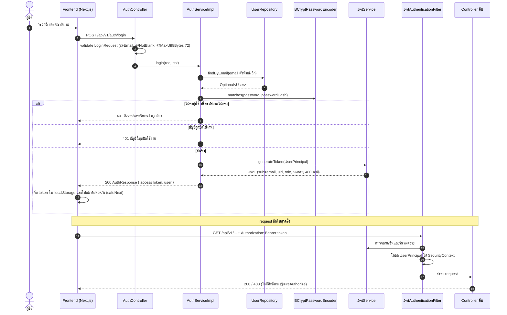
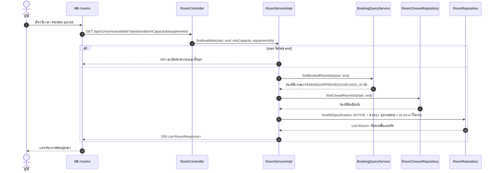
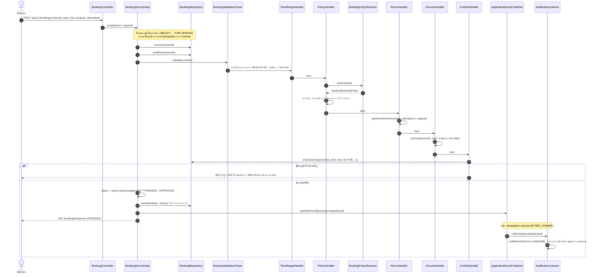
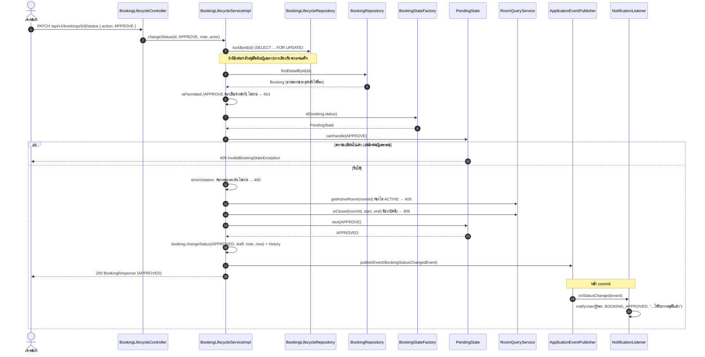
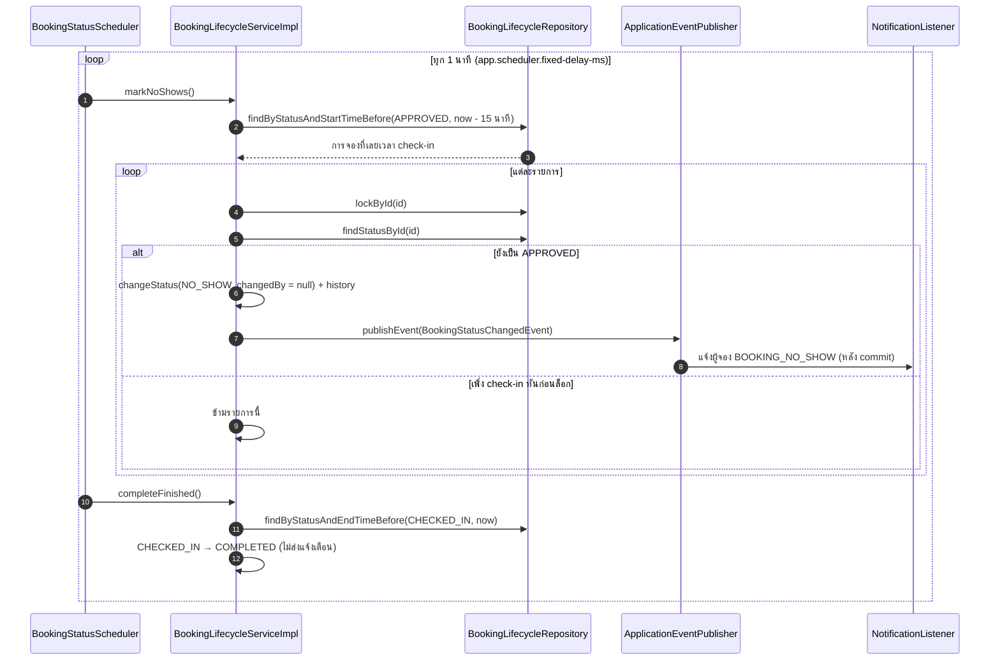
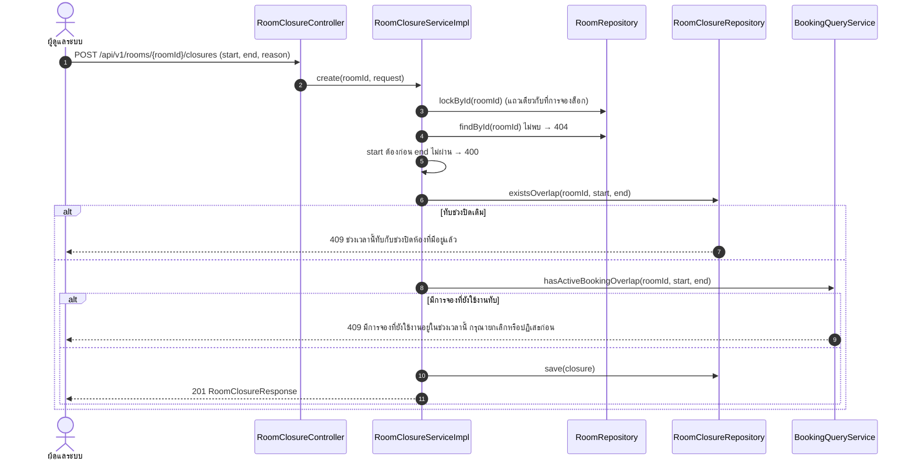
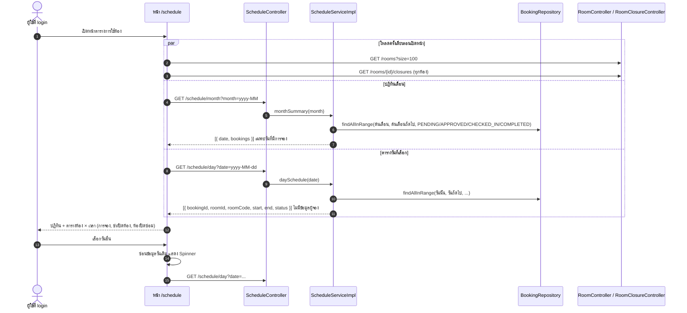

# Sequence Diagrams

ลำดับการทำงานของ use case สำคัญ ใช้ชื่อ class และ method ตามโค้ดจริง

| # | Sequence | Use Case |
|---|---|---|
| 1 | เข้าสู่ระบบและเรียก API ด้วย JWT | UC-02 |
| 2 | ค้นหาห้องว่าง | UC-04 |
| 3 | สร้างการจอง (ล็อก + Chain of Responsibility + Strategy + Observer) | UC-06 |
| 4 | อนุมัติการจอง (ล็อก + State + Observer) | UC-13 |
| 5 | Scheduler บันทึกไม่มาใช้ห้อง | UC-18 |
| 6 | สร้างช่วงปิดห้อง | UC-15 |
| 7 | ตารางการใช้ห้อง | UC-10 |

## 1. เข้าสู่ระบบและเรียก API ด้วย JWT

## 2. ค้นหาห้องว่าง

## 3. สร้างการจอง

## 4. อนุมัติการจอง

การปฏิเสธ (`REJECT`) ใช้ลำดับเดียวกัน ต่างกันที่ต้องมีเหตุผล (`note`) และไม่ตรวจห้อง ส่วนการ check-in ตรวจห้องเหมือนการอนุมัติ และต้องอยู่ในช่วง 15 นาทีก่อนถึง 15 นาทีหลังเวลาเริ่ม

## 5. Scheduler บันทึกไม่มาใช้ห้อง

## 6. สร้างช่วงปิดห้อง

## 7. ตารางการใช้ห้อง

