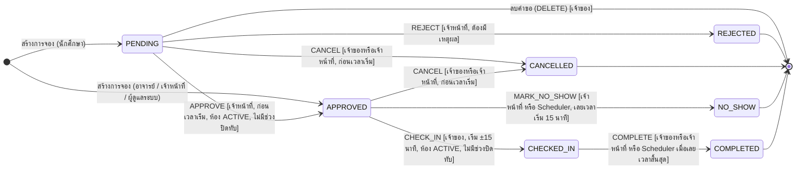
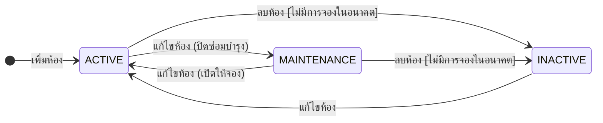
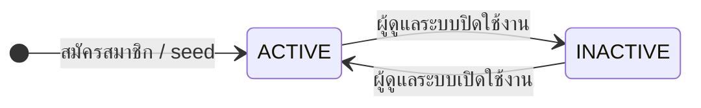

# State Diagram

## 1. สถานะการจอง (Booking)

วงจรสถานะการจอง implement ด้วย State Pattern ใน `service/state/` แต่ละสถานะเป็น class ที่บอกว่ารับ action อะไรได้และไปสถานะไหน (`AbstractBookingState.transitions`) ส่วนเงื่อนไขเรื่องสิทธิ์ เวลา และห้อง ตรวจใน `BookingLifecycleServiceImpl`

### ตารางการเปลี่ยนสถานะ

| สถานะ (class) | action ที่รับได้ → สถานะถัดไป | ใครทำได้ | เงื่อนไขเวลา / อื่น ๆ | แจ้งเตือนผู้จอง |
|---|---|---|---|---|
| `PENDING` (`PendingState`) | APPROVE → APPROVED | เจ้าหน้าที่, ผู้ดูแลระบบ | ก่อนเวลาเริ่ม, ห้อง ACTIVE และไม่มีช่วงปิดทับ | อนุมัติแล้ว |
| | REJECT → REJECTED | เจ้าหน้าที่, ผู้ดูแลระบบ | ต้องระบุเหตุผล | ถูกปฏิเสธ + เหตุผล |
| | CANCEL → CANCELLED | เจ้าของ, เจ้าหน้าที่ | ก่อนเวลาเริ่ม | ถูกยกเลิก |
| `APPROVED` (`ApprovedState`) | CHECK_IN → CHECKED_IN | เจ้าของเท่านั้น | ตั้งแต่ 15 นาทีก่อนถึง 15 นาทีหลังเวลาเริ่ม, ห้อง ACTIVE และไม่มีช่วงปิดทับ | - |
| | CANCEL → CANCELLED | เจ้าของ, เจ้าหน้าที่ | ก่อนเวลาเริ่ม | ถูกยกเลิก |
| | MARK_NO_SHOW → NO_SHOW | เจ้าหน้าที่ หรือ Scheduler | หลังเวลาเริ่ม 15 นาที | ไม่มาใช้ห้อง |
| `CHECKED_IN` (`CheckedInState`) | COMPLETE → COMPLETED | เจ้าของ, เจ้าหน้าที่ หรือ Scheduler | Scheduler ทำเมื่อเลยเวลาสิ้นสุด | - |
| `REJECTED`, `CANCELLED`, `COMPLETED`, `NO_SHOW` | ไม่มี (สถานะสุดท้าย) | - | - | - |

ลำดับการตรวจของ `changeStatus`: ล็อกแถว → สิทธิ์ (403) → state รับ action ได้ไหม (409) → เหตุผลกรณีปฏิเสธ (400) → เวลา (400) → ห้องยังใช้ได้ (400/409) → เปลี่ยนสถานะ + บันทึกประวัติ → publish event

สถานะที่ "ยังใช้งาน" (`BookingStatus.ACTIVE`) คือ PENDING, APPROVED, CHECKED_IN ใช้ตรวจเวลาชน นับโควตา และกันการปิดห้อง

## 2. สถานะห้อง (Room)

| สถานะ | จองได้ | อนุมัติ / check-in ได้ | ค้นหาห้อง | ค้นหาห้องว่าง |
|---|:-:|:-:|:-:|:-:|
| ACTIVE | ✓ | ✓ | ✓ | ✓ |
| MAINTENANCE | ✗ | ✗ | ✓ (แสดงป้าย) | ✗ |
| INACTIVE | ✗ | ✗ | ✗ | ✗ |

"ลบห้อง" ไม่ลบแถวจริง แต่เปลี่ยนเป็น INACTIVE เพราะการจองในอดีตยังอ้างอิงห้องอยู่

## 3. สถานะบัญชีผู้ใช้ (User)

บัญชี INACTIVE login ไม่ได้ (401 "บัญชีนี้ถูกปิดใช้งาน") แต่ข้อมูลการจองเดิมยังอยู่
