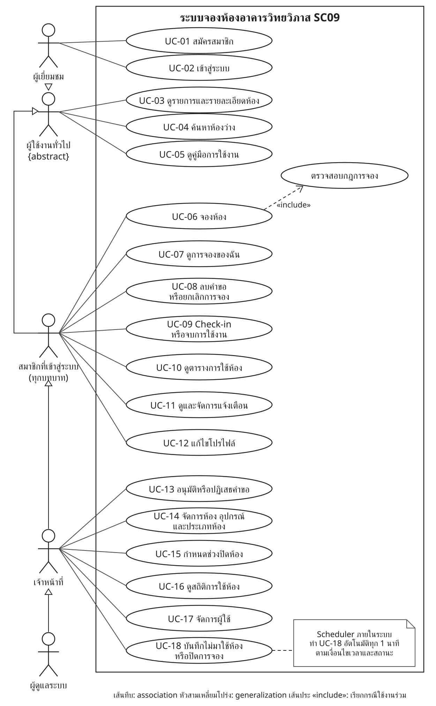

# Use Case Diagram

ระบบจองห้องอาคารวิทยวิภาส (SC09) มีผู้กระทำ 4 กลุ่ม ได้แก่ ผู้เยี่ยมชม (ยังไม่ login) สมาชิกที่เข้าสู่ระบบ (นักศึกษา `STUDENT` และอาจารย์ `LECTURER`) เจ้าหน้าที่ (`STAFF`) และผู้ดูแลระบบ (`ADMIN`) ผู้เยี่ยมชมกับสมาชิกสืบทอดจาก "ผู้ใช้งานทั่วไป" ซึ่งเป็น actor แบบ abstract ส่วน UC-18 ทำงานอัตโนมัติโดย Scheduler ภายในระบบ (`BookingStatusScheduler`) ทุก 1 นาที

## ภาพรวม Use Case

| สัญลักษณ์ | ความหมาย |
|---|---|
| เส้นทึบ | association: actor ใช้งาน use case นั้น |
| หัวสามเหลี่ยมโปร่ง | generalization: actor ลูกได้สิทธิ์ทั้งหมดของ actor แม่ (ผู้ดูแลระบบ → เจ้าหน้าที่ → สมาชิก → ผู้ใช้งานทั่วไป และผู้เยี่ยมชม → ผู้ใช้งานทั่วไป) |
| เส้นประ «include» | use case ที่ถูกเรียกทุกครั้ง: จองห้องต้องผ่านการตรวจสอบกฎการจอง (Chain of Responsibility) |
| กระดาษพับมุม | note อธิบายเพิ่มเติม |

> แผนภาพเป็นไฟล์ SVG (`images/use-case-diagram.svg`) เพราะ Mermaid ไม่มีชนิด Use Case Diagram แบบ UML ฉบับแก้ไขได้ (เปิดด้วย draw.io) อยู่ที่ `images/use-case-diagram.drawio`

## สิทธิ์ของแต่ละ Actor

| Use Case | ผู้เยี่ยมชม | นักศึกษา | อาจารย์ | เจ้าหน้าที่ | ผู้ดูแลระบบ | API หลัก |
|---|:-:|:-:|:-:|:-:|:-:|---|
| UC-01 สมัครสมาชิก | ✓ | | | | | `POST /auth/register` (สมัครได้เฉพาะ STUDENT, LECTURER) |
| UC-02 เข้าสู่ระบบ | ✓ | | | | | `POST /auth/login` |
| UC-03 ดูรายการและรายละเอียดห้อง | ✓ | ✓ | ✓ | ✓ | ✓ | `GET /rooms`, `GET /rooms/{id}` |
| UC-04 ค้นหาห้องว่าง | ✓ | ✓ | ✓ | ✓ | ✓ | `GET /rooms/available` |
| UC-05 ดูคู่มือ | ✓ | ✓ | ✓ | ✓ | ✓ | หน้า `/help` |
| UC-06 จองห้อง | | ✓ (รออนุมัติ) | ✓ (อนุมัติอัตโนมัติ) | ✓ (อนุมัติอัตโนมัติ) | ✓ | `POST /bookings` |
| UC-07 ดูการจองของฉัน | | ✓ | ✓ | ✓ | ✓ | `GET /users/{id}/bookings`, `GET /bookings/{id}` |
| UC-08 ลบคำขอ / ยกเลิก | | ✓ | ✓ | ✓ | ✓ | `DELETE /bookings/{id}`, `PATCH /bookings/{id}/status` (CANCEL) |
| UC-09 Check-in / จบการใช้งาน | | ✓ | ✓ | ✓* | ✓* | `PATCH /bookings/{id}/status` (CHECK_IN, COMPLETE) |
| UC-10 ตารางการใช้ห้อง | | ✓ | ✓ | ✓ | ✓ | `GET /schedule/month`, `GET /schedule/day` |
| UC-11 แจ้งเตือน | | ✓ | ✓ | ✓ | ✓ | `GET /users/me/notifications` และอื่น ๆ |
| UC-12 แก้ไขโปรไฟล์ | | ✓ | ✓ | ✓ | ✓ | `PUT /users/me/profile` |
| UC-13 อนุมัติ / ปฏิเสธ | | | | ✓ | ✓ | `PATCH /bookings/{id}/status` (APPROVE, REJECT) |
| UC-14 จัดการห้อง อุปกรณ์ ประเภท | | | | ✓ | ✓ | `/rooms`, `/equipment`, `/room-types` (POST/PUT/DELETE) |
| UC-15 ช่วงปิดห้อง | | | | ✓ | ✓ | `POST/DELETE /rooms/{id}/closures` |
| UC-16 สถิติ | | | | ✓ | ✓ | `GET /stats/summary`, `GET /stats/room-usage` |
| UC-17 จัดการผู้ใช้ | | | | ✓ | ✓ | `GET/PUT/DELETE /users/{id}` |
| UC-18 ไม่มาใช้ห้อง / ปิดการจอง | | | | ✓ (MARK_NO_SHOW) | ✓ | Scheduler เรียก `markNoShows()`, `completeFinished()` |

\* check-in ทำได้เฉพาะเจ้าของการจอง ส่วน "จบการใช้งาน" ทำได้ทั้งเจ้าของและเจ้าหน้าที่

## คำอธิบาย Use Case หลัก

### UC-04 ค้นหาห้องว่าง

| หัวข้อ | รายละเอียด |
|---|---|
| Actor | ทุกคน (ไม่ต้อง login) |
| เงื่อนไขก่อน | - |
| ขั้นตอนหลัก | 1. ผู้ใช้เลือก "ค้นหาห้องว่าง" ระบุวัน เวลาเริ่ม เวลาสิ้นสุด จำนวนคน และอุปกรณ์ที่ต้องการ 2. ระบบตัดห้องที่มีการจองสถานะ PENDING / APPROVED / CHECKED_IN ทับช่วงนั้น และห้องที่มีช่วงปิดทับออก 3. ระบบคืนเฉพาะห้องที่ ACTIVE ความจุพอ และมีอุปกรณ์ครบทุกชิ้น เรียงตามชั้นและรหัสห้อง |
| ทางเลือก | เวลาเริ่มไม่ก่อนเวลาสิ้นสุด → 400 "เวลาเริ่มต้องมาก่อนเวลาสิ้นสุด" |
| ผลลัพธ์ | รายการห้องว่าง พร้อมปุ่มจอง |

### UC-06 จองห้อง

| หัวข้อ | รายละเอียด |
|---|---|
| Actor | นักศึกษา อาจารย์ เจ้าหน้าที่ ผู้ดูแลระบบ |
| เงื่อนไขก่อน | login แล้ว บัญชี ACTIVE |
| ขั้นตอนหลัก | 1. ผู้ใช้กรอกห้อง วัน เวลา วัตถุประสงค์ จำนวนผู้เข้าร่วม 2. ระบบล็อกแถวผู้ใช้และห้อง 3. ระบบตรวจกฎตามลำดับ: เวลา → กฎตามบทบาท → ห้องและความจุ → ช่วงปิดห้อง → เวลาชน 4. บันทึกการจอง (นักศึกษา = PENDING, อื่น ๆ = APPROVED) และประวัติสถานะ 5. หลัง commit แจ้งเตือนเจ้าหน้าที่ทุกคน |
| ทางเลือก | ผิดกฎเวลา / บทบาท / ความจุ → 400, ห้องปิดหรือเวลาชน → 409, ห้องไม่พบ → 404 |
| ผลลัพธ์ | การจองใหม่ และเจ้าหน้าที่ได้รับแจ้งเตือน |

### UC-13 อนุมัติ / ปฏิเสธคำขอจอง

| หัวข้อ | รายละเอียด |
|---|---|
| Actor | เจ้าหน้าที่ ผู้ดูแลระบบ |
| เงื่อนไขก่อน | การจองสถานะ PENDING และยังไม่ถึงเวลาเริ่ม (กรณีอนุมัติ) |
| ขั้นตอนหลัก | 1. เจ้าหน้าที่เปิดคิวอนุมัติ 2. กดอนุมัติ หรือปฏิเสธพร้อมเหตุผล 3. ระบบล็อกแถวการจอง ตรวจสิทธิ์ → สถานะรับ action ได้ไหม (State) → เวลา → (อนุมัติ) ห้องยังเปิดและไม่มีช่วงปิดทับ 4. เปลี่ยนสถานะและบันทึกประวัติ 5. หลัง commit แจ้งเตือนผู้จอง |
| ทางเลือก | ไม่ใช่เจ้าหน้าที่ → 403, สถานะเปลี่ยนไปแล้ว → 409, ปฏิเสธโดยไม่มีเหตุผล / เลยเวลาเริ่ม / ห้องไม่เปิด → 400, ห้องมีช่วงปิดทับ → 409 |
| ผลลัพธ์ | การจองเป็น APPROVED หรือ REJECTED และผู้จองได้รับแจ้งเตือน |
