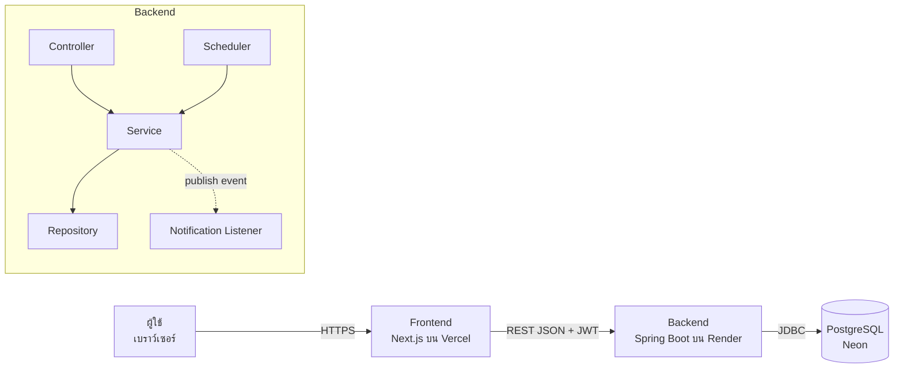

# บทที่ 3 การวิเคราะห์และออกแบบระบบ

## 3.1 ความต้องการของระบบ

### 3.1.1 ความต้องการเชิงหน้าที่ (Functional Requirements)

| รหัส | ความต้องการ | ผู้ใช้ |
|---|---|---|
| FR-01 | สมัครสมาชิกเป็นนักศึกษาหรืออาจารย์ และเข้าสู่ระบบด้วยอีเมลและรหัสผ่าน | ผู้เยี่ยมชม |
| FR-02 | ดูและแก้ไขโปรไฟล์ของตัวเอง | สมาชิก |
| FR-03 | ดูรายการห้อง ค้นหาด้วยคำค้น กรองตามชั้น ประเภท ความจุ อุปกรณ์ เรียงลำดับและแบ่งหน้า | ทุกคน |
| FR-04 | ค้นหาห้องที่ว่างในช่วงเวลาที่ระบุ | ทุกคน |
| FR-05 | ส่งคำขอจองห้อง โดยระบบตรวจกฎตามบทบาท เวลาเปิดอาคาร ช่วงปิดห้อง และเวลาชน | สมาชิก |
| FR-06 | ดูการจองของตัวเอง ยกเลิก ลบคำขอที่ยังรออนุมัติ และ check-in | สมาชิก |
| FR-07 | ดูตารางการใช้ห้องรายวันของแต่ละห้อง และตารางการใช้ห้องทั้งอาคาร (ปฏิทินรายเดือน) | สมาชิก |
| FR-08 | อนุมัติหรือปฏิเสธคำขอจอง (ปฏิเสธต้องระบุเหตุผล) และดูประวัติการเปลี่ยนสถานะ | เจ้าหน้าที่, ผู้ดูแล |
| FR-09 | เพิ่ม แก้ไข ลบ ห้อง ประเภทห้อง อุปกรณ์ และกำหนดอุปกรณ์พร้อมจำนวนให้ห้อง | เจ้าหน้าที่, ผู้ดูแล |
| FR-10 | กำหนดและลบช่วงปิดห้อง | เจ้าหน้าที่, ผู้ดูแล |
| FR-11 | ดูรายชื่อผู้ใช้ เปลี่ยนบทบาท ปิด/เปิดใช้งานบัญชี | เจ้าหน้าที่, ผู้ดูแล |
| FR-12 | แจ้งเตือนในระบบเมื่อมีคำขอใหม่หรือสถานะการจองเปลี่ยน อ่านและลบแจ้งเตือน | สมาชิก |
| FR-13 | ดูสถิติจำนวนการจองตามสถานะและชั่วโมงการใช้แต่ละห้อง | เจ้าหน้าที่, ผู้ดูแล |
| FR-14 | บันทึกไม่มาใช้ห้อง (NO_SHOW) และปิดการจองที่ใช้เสร็จ (COMPLETED) อัตโนมัติ | ระบบ (Scheduler) |
| FR-15 | หน้าคู่มือการใช้งาน | ทุกคน |

### 3.1.2 ความต้องการที่ไม่ใช่เชิงหน้าที่ (Non-functional Requirements)

| รหัส | ด้าน | ความต้องการ |
|---|---|---|
| NFR-01 | ความปลอดภัย | เก็บรหัสผ่านด้วย BCrypt, ยืนยันตัวตนด้วย JWT, ตรวจสิทธิ์ทุก endpoint, ไม่ส่ง stack trace ให้ผู้ใช้, secret ของ production อยู่ใน environment variable (ค่าใน application.properties ใช้บนเครื่องนักพัฒนาเท่านั้น) |
| NFR-02 | ความถูกต้องของข้อมูล | ไม่มีการจองซ้อนกันแม้มีคำขอพร้อมกัน, constraint ในฐานข้อมูลเป็นด่านสุดท้าย |
| NFR-03 | การดูแลรักษา | โครงสร้างแบบชั้น ตามหลัก SOLID, migration มีเวอร์ชัน, coverage ของ test ไม่น้อยกว่า 70% |
| NFR-04 | การใช้งาน | UI ภาษาไทย รองรับมือถือ ข้อความ error เข้าใจง่าย |
| NFR-05 | ความพร้อมใช้งาน | deploy บนคลาวด์ เข้าถึงผ่าน HTTPS ได้ตลอดเวลา |
| NFR-06 | ความสามารถในการตรวจสอบ | เก็บประวัติการเปลี่ยนสถานะทุกครั้ง พร้อมผู้ทำและเหตุผล |
| NFR-07 | การส่งมอบ | CI ต้องผ่านก่อน merge, deploy อัตโนมัติจาก `develop` |

### 3.1.3 กฎทางธุรกิจ (Business Rules)

| กฎ | นักศึกษา | อาจารย์ | เจ้าหน้าที่ / ผู้ดูแล |
|---|:-:|:-:|:-:|
| จองได้นานสุดต่อครั้ง | 2 ชม. | 4 ชม. | 8 ชม. |
| จองล่วงหน้าได้ไม่เกิน | 7 วัน | 30 วัน | 90 วัน |
| การจองที่ยังใช้งานพร้อมกันได้ | 2 | 5 | ไม่จำกัด |
| ต้องรออนุมัติ | ใช่ | ไม่ (อนุมัติอัตโนมัติ) | ไม่ (อนุมัติอัตโนมัติ) |

กฎร่วม

- BR-01 จองได้เฉพาะ 08:00–22:00 น. ภายในวันเดียว และเวลาเริ่มต้องอยู่ในอนาคต
- BR-02 จำนวนผู้ใช้ห้องต้องไม่เกินความจุ และห้องต้องเปิดใช้งาน (ACTIVE)
- BR-03 ห้ามจองทับช่วงปิดห้อง และห้ามชนกับการจองที่ยังใช้งาน (ต่อกันพอดีได้)
- BR-04 check-in ได้ตั้งแต่ 15 นาทีก่อนถึง 15 นาทีหลังเวลาเริ่ม เกินจากนั้นระบบบันทึก NO_SHOW
- BR-05 ปฏิเสธต้องมีเหตุผล ยกเลิกได้เฉพาะก่อนเริ่มใช้ห้อง
- BR-06 ลบห้องและผู้ใช้เป็นการปิดใช้งาน (เปลี่ยนสถานะเป็น INACTIVE) ไม่ลบแถวจริง ห้องที่ยังมีการจองในอนาคต ประเภทห้องที่ยังมีห้องใช้ และอุปกรณ์ที่ยังติดตั้งในห้อง ลบไม่ได้ (ตอบ 409)
- BR-07 สมัครเองได้เฉพาะบทบาทนักศึกษาหรืออาจารย์ บทบาทเจ้าหน้าที่/ผู้ดูแลต้องให้ผู้ดูแลกำหนด

## 3.2 แผนภาพกรณีใช้งาน (Use Case Diagram)

ระบบมีผู้กระทำ 5 กลุ่ม (ผู้เยี่ยมชม สมาชิก เจ้าหน้าที่ ผู้ดูแลระบบ และ Scheduler) และกรณีใช้งาน 18 กรณี (UC-01 ถึง UC-18) แผนภาพ ตารางสิทธิ์ และคำอธิบายกรณีใช้งานหลักอยู่ใน [use-case-diagram.md](../diagrams/use-case-diagram.md)

## 3.3 แผนภาพคลาสเชิงแนวคิด (Conceptual Class Diagram)

แสดงแนวคิดหลักของโดเมน ได้แก่ ผู้ใช้ ห้อง ประเภทห้อง อุปกรณ์ (ผ่าน association class อุปกรณ์ในห้อง) การจอง ประวัติสถานะ ช่วงปิดห้อง และแจ้งเตือน ดูที่ [Conceptual-Class-Diagram.md](../diagrams/Conceptual-Class-Diagram.md)

## 3.4 การออกแบบฐานข้อมูล

ฐานข้อมูลมี 10 ตาราง สร้างด้วย Flyway migration V1–V5

| ตาราง | เก็บข้อมูล |
|---|---|
| `users` | ผู้ใช้ บทบาท สถานะ |
| `user_profiles` | ข้อมูลโปรไฟล์ (1:1 กับ users) |
| `room_types` | ประเภทห้อง |
| `rooms` | ห้อง ชั้น ความจุ สถานะ |
| `equipment` | อุปกรณ์ |
| `room_equipment` | อุปกรณ์ในห้องพร้อมจำนวน (Many-to-Many) |
| `room_closures` | ช่วงปิดห้อง |
| `bookings` | การจอง |
| `booking_status_history` | ประวัติการเปลี่ยนสถานะ |
| `notifications` | แจ้งเตือน |

(นอกจากนี้ Flyway สร้างตาราง `flyway_schema_history` เก็บประวัติ migration เอง)

จุดสำคัญของการออกแบบ

- ใช้ `CHECK` constraint ตรวจค่า enum, ช่วงเวลา (`end_time > start_time`) และจำนวน (`attendees > 0`, `quantity > 0`)
- `UNIQUE` บน email, รหัสห้อง, ชื่อประเภท และชื่ออุปกรณ์ ส่วน `room_equipment` ใช้ PRIMARY KEY คู่ (room_id, equipment_id)
- index บน (room_id, start_time, end_time) สำหรับตรวจเวลาชนและตาราง
- `ON DELETE CASCADE` เฉพาะข้อมูลที่เป็นส่วนหนึ่งของแม่ เช่น ประวัติสถานะและแจ้งเตือน ส่วน `bookings` ไม่ใส่ CASCADE กับผู้ใช้และห้อง และระบบไม่ลบผู้ใช้หรือห้องจริง (เปลี่ยนเป็น INACTIVE แทน) เพื่อเก็บประวัติการจอง

ER Diagram, ตารางความสัมพันธ์ และ Data Dictionary ครบทุกคอลัมน์อยู่ใน [er-diagram.md](../diagrams/er-diagram.md)

## 3.5 สถาปัตยกรรมระบบ

แผนภาพ Component และ Deployment (production บนคลาวด์ และ Docker Compose บนเครื่อง) อยู่ใน [component-deployment-diagram.md](../diagrams/component-deployment-diagram.md)

## 3.6 แผนภาพคลาสและ Design Pattern

Class Diagram แบ่งเป็น 6 แผนภาพ ได้แก่ entity และ enum, โครงสร้างแบบชั้นของโมดูลการจอง, Chain of Responsibility + Strategy, State, Observer และ interface ตามหลัก ISP ดูที่ [class-diagram.md](../diagrams/class-diagram.md)

สรุปการใช้ Design Pattern

| Pattern | class หลัก | ผู้รับผิดชอบ |
|---|---|---|
| Strategy | `BookingPolicy`, `StudentBookingPolicy`, `LecturerBookingPolicy`, `StaffBookingPolicy`, `BookingPolicyResolver` | ดรัณภพ |
| Chain of Responsibility | `BookingValidationHandler`, `TimeRangeHandler` → `PolicyHandler` → `RoomHandler` → `ClosureHandler` → `ConflictHandler` | อนัตตา |
| State | `BookingState`, `AbstractBookingState`, 7 สถานะ, `BookingStateFactory` | พัชรพล |
| Observer | `BookingCreatedEvent`, `BookingStatusChangedEvent`, `ApplicationEventPublisher`, `NotificationListener`, `NotificationSender` | ศุภกิตติ์ |

คำอธิบายเหตุผล โครงสร้าง และตัวอย่างโค้ดอยู่ใน [design-patterns.md](../design-patterns.md) และการวิเคราะห์ SOLID อยู่ใน [solid-analysis.md](../solid-analysis.md)

## 3.7 แผนภาพสถานะ (State Diagram)

การจองมี 7 สถานะ: `PENDING`, `APPROVED`, `REJECTED`, `CANCELLED`, `CHECKED_IN`, `COMPLETED`, `NO_SHOW` โดย `REJECTED`, `CANCELLED`, `COMPLETED`, `NO_SHOW` เป็นสถานะสุดท้าย แผนภาพพร้อมเงื่อนไข (guard) ของแต่ละการเปลี่ยนสถานะ และสถานะของห้องและผู้ใช้ อยู่ใน [state-diagram.md](../diagrams/state-diagram.md)

## 3.8 แผนภาพลำดับและแผนภาพกิจกรรม

- [sequence-diagrams.md](../diagrams/sequence-diagrams.md) — 7 แผนภาพ: เข้าสู่ระบบด้วย JWT, ค้นหาห้องว่าง, สร้างการจอง (ล็อก + chain + event), อนุมัติ, Scheduler บันทึก NO_SHOW, สร้างช่วงปิดห้อง, ตารางการใช้ห้อง
- [activity-diagram.md](../diagrams/activity-diagram.md) — กระบวนการจองแบบ swimlane, ลำดับการตรวจกฎ และขั้นตอนอนุมัติของเจ้าหน้าที่

## 3.9 การออกแบบ API

ทุก endpoint อยู่ใต้ `/api/v1` เอกสารแบบโต้ตอบได้อยู่ที่ Swagger UI (`/swagger-ui.html`)

สัญลักษณ์สิทธิ์: **สาธารณะ** = ไม่ต้อง login, **สมาชิก** = login แล้ว, **S/A** = เจ้าหน้าที่หรือผู้ดูแล, **เจ้าของ** = เจ้าของข้อมูลหรือ S/A

| Method | Endpoint | หน้าที่ | สิทธิ์ |
|---|---|---|---|
| POST | `/auth/register` | สมัครสมาชิก | สาธารณะ |
| POST | `/auth/login` | เข้าสู่ระบบ รับ JWT | สาธารณะ |
| GET | `/users/me` | ข้อมูลของฉัน | สมาชิก |
| PUT | `/users/me/profile` | แก้โปรไฟล์ | สมาชิก |
| GET | `/users` | รายชื่อผู้ใช้ (กรองตามบทบาท แบ่งหน้า) | S/A |
| GET | `/users/{id}` | ข้อมูลผู้ใช้ | เจ้าของ |
| PUT | `/users/{id}` | เปลี่ยนบทบาท/สถานะ | S/A |
| DELETE | `/users/{id}` | ปิดใช้งานผู้ใช้ | S/A |
| GET | `/rooms` | รายการห้อง (คำค้น ชั้น ประเภท ความจุ อุปกรณ์ เรียง แบ่งหน้า) | สาธารณะ |
| GET | `/rooms/available` | ห้องว่างในช่วงเวลา | สาธารณะ |
| GET | `/rooms/{id}` | รายละเอียดห้อง | สาธารณะ |
| POST / PUT / DELETE | `/rooms`, `/rooms/{id}` | เพิ่ม แก้ ลบห้อง (ลบ = เปลี่ยนเป็น INACTIVE) | S/A |
| PUT | `/rooms/{id}/equipment` | กำหนดอุปกรณ์ในห้อง | S/A |
| GET / POST / PUT / DELETE | `/room-types`, `/room-types/{id}` | ประเภทห้อง (อ่านสาธารณะ เขียน S/A) | สาธารณะ / S/A |
| GET / POST / PUT / DELETE | `/equipment`, `/equipment/{id}` | อุปกรณ์ (อ่านสาธารณะ เขียน S/A) | สาธารณะ / S/A |
| GET | `/rooms/{roomId}/closures` | ช่วงปิดห้อง | สมาชิก |
| POST / DELETE | `/rooms/{roomId}/closures`, `/{closureId}` | เพิ่ม ลบช่วงปิดห้อง | S/A |
| POST | `/bookings` | สร้างการจอง | สมาชิก |
| GET | `/bookings` | การจองทั้งหมด (กรองสถานะ ห้อง ช่วงวัน) | S/A |
| GET | `/bookings/{id}` | รายละเอียดการจอง | เจ้าของ |
| PUT | `/bookings/{id}` | แก้ไขการจองที่ยังรออนุมัติ | เจ้าของ |
| DELETE | `/bookings/{id}` | ลบคำขอที่ยังรออนุมัติ | เจ้าของ |
| GET | `/users/{userId}/bookings` | การจองของผู้ใช้ | เจ้าของ |
| GET | `/rooms/{roomId}/bookings` | ตารางห้องรายวัน | สมาชิก |
| PATCH | `/bookings/{id}/status` | เปลี่ยนสถานะ (APPROVE, REJECT, CANCEL, CHECK_IN, COMPLETE, MARK_NO_SHOW) | ตาม action |
| GET | `/bookings/{id}/history` | ประวัติสถานะ | เจ้าของ |
| GET | `/bookings/{id}/allowed-actions` | action ที่ทำได้ตอนนี้ | เจ้าของ |
| GET | `/schedule/month` | จำนวนการจองรายวันในเดือน (ปฏิทิน) | สมาชิก |
| GET | `/schedule/day` | ตารางรวมทุกห้องในวันที่เลือก | สมาชิก |
| GET | `/users/me/notifications` | แจ้งเตือนของฉัน (แบ่งหน้า) | สมาชิก |
| GET | `/users/me/notifications/unread-count` | จำนวนที่ยังไม่อ่าน | สมาชิก |
| PATCH | `/users/me/notifications/read-all` | อ่านทั้งหมด | สมาชิก |
| PATCH | `/notifications/{id}/read` | อ่านรายการเดียว | เจ้าของ |
| DELETE | `/notifications/{id}` | ลบแจ้งเตือน | เจ้าของ |
| GET | `/stats/summary` | สรุปจำนวนการจองตามสถานะ | S/A |
| GET | `/stats/room-usage` | ชั่วโมงการใช้แต่ละห้อง | S/A |

สิทธิ์ของ action ใน `PATCH /bookings/{id}/status`: APPROVE, REJECT และ MARK_NO_SHOW เฉพาะ S/A, CHECK_IN เฉพาะเจ้าของการจอง, CANCEL และ COMPLETE เจ้าของหรือ S/A

## 3.10 การออกแบบหน้าจอ

| Route | หน้าจอ | ผู้ใช้ |
|---|---|---|
| `/` | หน้าแรก แนะนำระบบ และทางลัดไปหน้าห้องหรือการจอง | ทุกคน |
| `/login`, `/register` | เข้าสู่ระบบ สมัครสมาชิก | ผู้เยี่ยมชม |
| `/rooms` | รายการห้อง ค้นหา กรอง แบ่งหน้า และค้นหาห้องว่างตามช่วงเวลา | ทุกคน |
| `/rooms/[id]` | รายละเอียดห้อง อุปกรณ์ ปุ่มจอง และช่วงปิดห้อง (แสดงเมื่อ login) | ทุกคน |
| `/rooms/[id]/book` | ฟอร์มจอง พร้อมตารางห้องของวันที่เลือก (รับวันที่ต่อจากหน้าตารางการใช้ห้องได้) | สมาชิก |
| `/schedule` | ตารางการใช้ห้อง: ปฏิทินรายเดือน + ตารางห้อง × เวลา | สมาชิก |
| `/bookings` | การจองของฉัน กรองตามสถานะ | สมาชิก |
| `/bookings/[id]` | รายละเอียด ปุ่ม action และประวัติสถานะ | สมาชิก |
| `/notifications` | รายการแจ้งเตือน | สมาชิก |
| `/profile` | โปรไฟล์ | สมาชิก |
| `/help` | คู่มือการใช้งาน | ทุกคน |
| `/admin/dashboard` | สถิติ: การจองทั้งหมด วันนี้ รออนุมัติ จำนวนห้อง ผู้ใช้ และชั่วโมงใช้แต่ละห้อง | S/A |
| `/admin/approvals` | คิวคำขอรออนุมัติ | S/A |
| `/admin/rooms` | จัดการห้อง อุปกรณ์ในห้อง ช่วงปิด | S/A |
| `/admin/equipment` | จัดการอุปกรณ์และประเภทห้อง | S/A |
| `/admin/users` | จัดการผู้ใช้ | S/A |

หลักการออกแบบ UI: ใช้ component กลาง (`components/ui.tsx`) ให้หน้าตาเหมือนกันทั้งระบบ, สีป้ายสถานะคงที่ (รออนุมัติ = เหลือง, อนุมัติ = เขียว, ปฏิเสธ = แดง, กำลังใช้ = ฟ้า, ไม่มาใช้ = ส้ม ฯลฯ) และมีข้อความกำกับทุกป้าย, เมนูแสดงตามบทบาท, layout แบบ responsive และ redirect หลัง login เฉพาะ path ภายในระบบเท่านั้น

## 3.11 การออกแบบความปลอดภัย

| ภัยคุกคาม | วิธีป้องกัน |
|---|---|
| ขโมยรหัสผ่านจากฐานข้อมูล | BCrypt hash + จำกัด 72 ไบต์ |
| ปลอม token | JWT ลงลายเซ็นด้วย secret ยาว ≥ 256 บิต จาก environment variable |
| เข้าถึงข้อมูลผู้อื่น (IDOR) | ตรวจเจ้าของใน `@PreAuthorize` และ service ทุกครั้ง |
| ยกระดับสิทธิ์ตอนสมัคร | สมัครเองได้เฉพาะ STUDENT/LECTURER |
| บัญชีถูกปิดยังใช้ token เดิม | ตรวจสถานะผู้ใช้ทุก request ใน filter |
| SQL Injection | ใช้ JPA parameter binding ไม่ต่อ string |
| Open redirect หลัง login | รับเฉพาะ path ที่ขึ้นต้นด้วย `/` และไม่ใช่ `//` |
| ข้อมูลภายในรั่วผ่าน error | `GlobalExceptionHandler` คืนข้อความกลาง ไม่ส่ง stack trace |
| CORS | อนุญาตเฉพาะ origin ของ frontend ที่กำหนด |
| Race condition ตอนจอง | Pessimistic lock ตามลำดับ ผู้ใช้ → ห้อง → การจอง |
